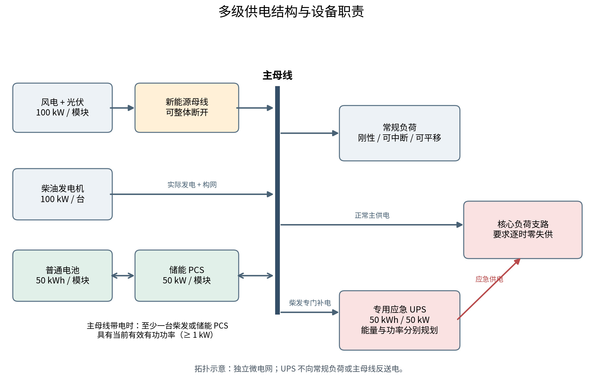
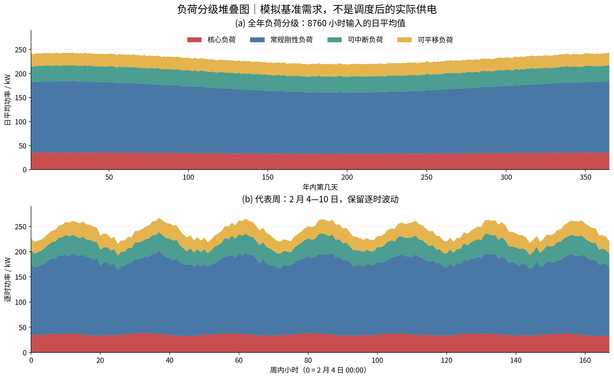
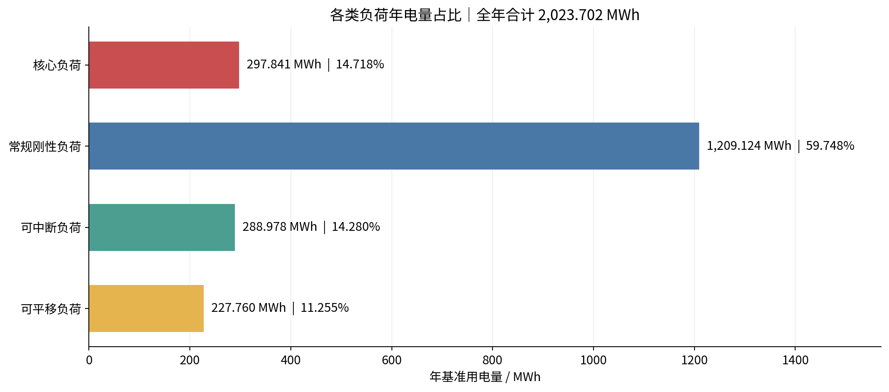
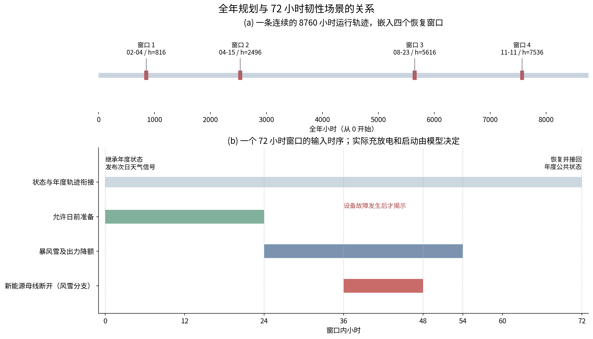
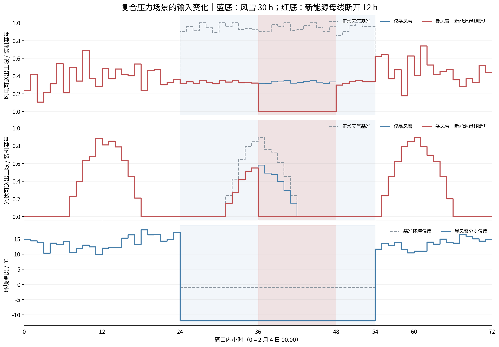
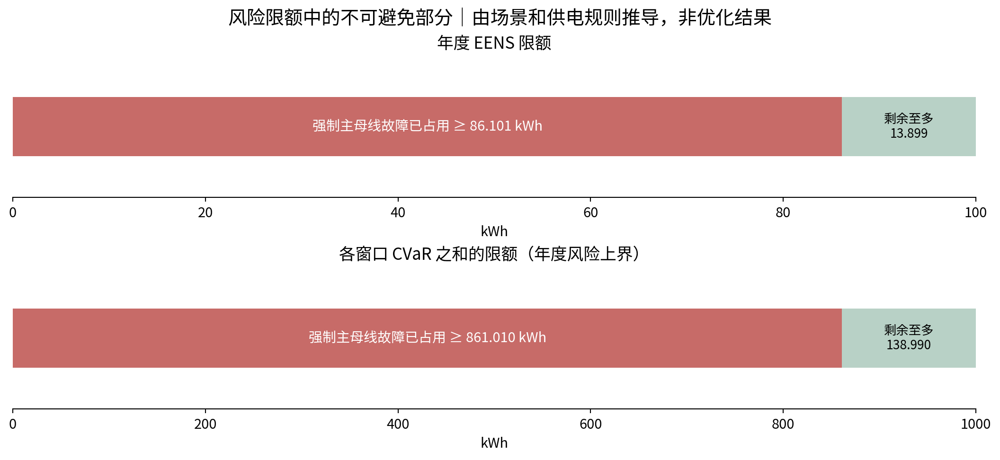

# 全年容量规划与多级供电韧性模型：组会汇报说明

> **模型主线：** 在全年 8760 小时的用能需求下，联合确定风电、光伏、柴油机、普通电池、储能 PCS 和专用应急 UPS 的离散容量；通过负荷分级、普通储能调节、柴油机恢复和 UPS 应急接管，在给定极端天气及偶发故障场景下保障核心负荷，限制常规负荷失供，并综合考虑投资与全年运行费用。
>
> **本文范围：** 介绍现版本的物理结构、数学模型、算例输入和研究假设，供组会汇报使用。文中的负荷统计来自当前正式年度算例的冻结输入；容量下限和风险下限由约束推导，不是最终配置结果。本文不讨论求解方法与求解器。
>
> **数据属性：** 当前使用经授权生成的模拟年度数据，服务于中山站背景下的模型研究；这些数据并非中山站实测记录，设备费用也并非采购报价。功率单位为 kW，电量单位为 kWh，费用单位为元；时间分辨率为 1 小时。所有小数表格均按显示位数四舍五入，计算使用完整精度。

## 1. 模型要回答什么问题

这个规划问题包含三个相互联系的判断。

第一，**平时需要建设多少设备**。风光出力随时间变化，负荷也有峰谷，因此不能只看某个事故时刻的功率够不够，还要看全年发电、用电、储能循环和燃油消耗。

第二，**事故发生后，各级资源怎样接力**。普通电池和可调负荷首先提供运行灵活性；柴油机承担可持续的可控供电，但启动受到人员准备、机舱温度和故障状态约束；UPS位于核心负荷专用支路，在允许的紧急状态下提供应急电力。

第三，**哪些用电变化属于调节，哪些属于损失**。核心负荷不允许失供；常规负荷允许在规定范围内主动调节，超出正常服务规则的被迫停电才计入韧性指标和损失费用。当前另有一条严格供电优先规则：UPS接管核心负荷时，该时段常规负荷退出供电，相关损失必须统计。

因此，模型同时决定两类变量：一类是全年的共同装机容量，另一类是不同已观测情景下的逐时运行决策。容量和运行相互约束，不能把设备容量先定死后再评价事故。

## 2. 系统结构：各类设备承担什么职责

**图 1 的读法：** 风电和光伏经新能源母线送到主母线；柴油机、普通电池及其PCS接入主母线。主母线正常时供应核心负荷与常规负荷。UPS通过独立支路供应核心负荷，使用后由柴油机专门补电。箭头表示模型中的功率流关系，不表示已经建立了详细配电潮流模型。

| 资源 | 正常运行作用 | 扰动期间作用 | 现版本的关键限制 |
|---|---|---|---|
| 风电、光伏 | 提供可再生电量 | 天气和连接条件允许时继续供电 | 暴风雪降额；新能源母线断开时两者送出均为零 |
| 普通电池 + 储能PCS | 充放电调节、利用可再生电力 | 支撑主母线、供给各类负荷、为柴发准备争取时间 | 有电量与功率限制；PCS必须有电池支撑 |
| 可调负荷 | 在允许范围内中断或平移需求 | 减少事故时刻的供需缺口 | 合法调节不计失供，强制损失仍计失供 |
| 柴油发电机 | 按需要承担可控供电 | 启动后提供持续供电和构网支撑 | 需要准备、升温且设备健康；有运行故障与启动失败 |
| 专用应急UPS | 保持备用电量 | 在紧急状态下保住核心负荷 | 不参与正常新能源消纳，不供应常规负荷，不向主母线提供构网支撑 |

当前系统按**独立微电网**设置，外部电网供电关闭。所有柴油机和普通储能PCS均具备构网能力，但是否可以计入某小时的主母线构网支撑，还要检查该小时实际有功功率。UPS变流器即使具备相应硬件能力，其连接范围也只覆盖核心支路，不能据此宣布主母线已恢复。

## 3. 负荷分级与全年精确数据

### 3.1 四类负荷的定义

把时刻 $t$ 的原始总负荷写为：

$$
L_t=L_t^{C}+L_t^{R}+L_t^{I}+L_t^{S}.
$$

其中，$C$ 表示核心负荷，$R$ 表示常规刚性负荷，$I$ 表示可中断负荷，$S$ 表示可平移负荷。后三者都属于常规负荷。

| 类别 | 运行要求 | 允许的灵活性 | 韧性统计口径 |
|---|---|---|---|
| 核心负荷 $L_t^C$ | 每个建模时段必须供足 | 不允许中断或平移 | 失供量固定为零，是硬约束 |
| 常规刚性负荷 $L_t^R$ | 尽可能按原曲线供电 | 无主动调节能力 | 实际被切除的电量全部计入损失 |
| 可中断负荷 $L_t^I$ | 在约定服务范围内供电 | 允许有限主动削减 | 合法削减不算失供；被迫切除算失供 |
| 可平移负荷 $L_t^S$ | 用电任务在期限内完成 | 允许改变完成时刻 | 按期完成不算失供；应急取消、到期未完成算失供 |

### 3.2 全年负荷统计

统计基准为 2026 年 1 月 1 日至 12 月 31 日，共 8760 个小时；输入时间戳采用 UTC+08:00。这只是模拟时标，不代表现场时区和逐时实测记录已经校准。

| 负荷类别 | 年电量 / kWh | 年电量占比 | 平均功率 / kW | 最小功率 / kW | 峰值功率 / kW |
|---|---:|---:|---:|---:|---:|
| 核心负荷 | 297,840.518 | 14.718% | 34.000 | 28.362 | 39.828 |
| 常规刚性负荷 | 1,209,123.697 | 59.748% | 138.028 | 111.148 | 166.751 |
| 可中断负荷 | 288,977.882 | 14.280% | 32.988 | 22.923 | 43.457 |
| 可平移负荷 | 227,760.000 | 11.255% | 26.000 | 22.000 | 30.000 |
| **总负荷** | **2,023,702.096** | **100.000%** | **231.016** | **192.283** | **267.942** |

各类负荷峰值可能出现在不同小时，因此不能把四类峰值直接相加当作系统峰值。由于显示位数有限，表格分项电量和比例的末位可能与合计有微小舍入差异。

核心负荷年电量占比的计算方法是：

$$
\rho_C=
\frac{\sum_{t=0}^{8759}L_t^C\Delta t}
{\sum_{t=0}^{8759}L_t\Delta t}
=\frac{297840.517548}{2023702.096154}
=14.7176068\%.
$$

**14.718%是年电量占比，不是每小时固定比例。** 当前输入中，核心负荷逐时占比最低为12.667%，最高为17.182%。常规负荷合计占全年电量的85.282%；其中两类可调负荷合计占25.534%。这个25.534%表示具备一定调节能力的负荷规模，不表示这些负荷可以全部、无限期地免费停用。

全年总负荷峰值为267.942 kW，出现在2月16日13:00，对应分项为核心35.516 kW、刚性164.127 kW、可中断39.471 kW、可平移28.828 kW。

**图 2 的读法：** 每个颜色带的厚度是该类负荷功率，四种颜色叠加后的上沿是总负荷。上图为全年每日平均功率，用来展示季节变化；下图为2月4—10日的逐时数据，用来展示日内波动。上图进行了日平均，不能从图上的最高点读取全年逐时峰值。两图均为调度前的基准需求，未扣除负荷调节和停电损失。

**图 3 的读法：** 条形长度表示全年用电量，旁边标出其占总电量的比例。刚性常规负荷占比最大，意味着仅依靠柔性调节不能解决所有事故供电问题；核心负荷虽然只占约14.7%，但由于不能失供，需要独立应急保障。

### 3.3 数据是怎样构造的

负荷生成器使用季节项、日内周期项和有限随机扰动，模拟稳定核心用电、较大的刚性需求和两类可调需求。当前随机种子为20260923。没有把全部负荷机械地按固定比例拆分，因此核心占比随小时变化。

基准风电和光伏输入均为标幺可用功率系数。其全年均值分别为0.435025和0.218739；在暂不考虑弃电、场景降额和母线故障时，分别对应3810.818小时和1916.156小时的等效利用小时。背景环境温度均值为3.902℃，范围为$[-10.121,19.363]$℃；暴风雪分支再按第6节覆写相应温度。

这些统计说明当前输入的规模与形状。它们不能代替中山站逐时气象、风机功率曲线、组件参数及现场负荷清单的校准。

## 4. 规划变量：七类容量全部按整数模块配置

令七类模块数量为：

$$
\boldsymbol n=(n_W,n_{PV},n_D,n_B,n_{PCS},n_{UE},n_{UP}),
\qquad n_k\in\mathbb Z_{\ge0}.
$$

其中容量对应关系为：

$$
P_W=100n_W,\quad P_{PV}=100n_{PV},\quad P_D=100n_D,
$$

$$
E_B=50n_B,\quad P_B=50n_{PCS},\quad
E_U=50n_{UE},\quad P_U=50n_{UP}.
$$

$E_B,E_U$是额定电量；$P_B,P_U$是变流器额定功率。UPS能量模块与功率模块是两个独立规划变量，不要求模块数量相同。

| 设备 | 单模块规格 | 投资单价 | 每模块投资 |
|---|---:|---:|---:|
| 风电 | 100 kW | 1500元/kW | 150,000元 |
| 光伏 | 100 kW | 1000元/kW | 100,000元 |
| 柴油机 | 100 kW | 1800元/kW | 180,000元 |
| 普通电池 | 50 kWh | 250元/kWh | 12,500元 |
| 储能PCS | 50 kW | 400元/kW | 20,000元 |
| UPS能量部分 | 50 kWh | 750元/kWh | 37,500元 |
| UPS功率部分 | 50 kW | 1200元/kW | 60,000元 |

这些容量在模型内就是整数模块的组合，**不存在先得到任意连续容量，再把结果向上或向下取整的步骤**。设备数量没有预先固定为少数几个候选档位，容量选择仍需满足物理、备用和风险约束。

UPS的能量单价和功率单价分别是普通电池和PCS的3倍。以同为50 kWh电量、50 kW功率的一组设备为例，普通储能对应32,500元，UPS对应97,500元；这里只比较相同规格的合成投资，不等于完整工程造价。

储能PCS与电池必须配套：

$$
E_B\ge T_B^{\min}P_B,\qquad T_B^{\min}=1\ \mathrm h.
$$

因此，若配置200 kW储能PCS，就至少需要200 kWh电池。这个1小时是当前最小配套时长假设，不能据此认为电池在任何时刻都有1小时满功率余量；实际可用电量还取决于当时SOC。

## 5. 时间结构：8760小时是主体，72小时是嵌入窗口

### 5.1 为什么同时需要两个时间尺度

全年逐时轨迹负责回答设备在一年内是否经济、能量是否连续、季节性供需是否匹配。72小时窗口负责详细展开预警、故障、柴油机准备、应急供电和恢复过程。

本版设置四个互不重叠的72小时窗口：

| 窗口 | 全年起始小时，从0计数 | 窗口开始 | 窗口结束，不含该时刻 | 主要故障时刻 |
|---|---:|---|---|---|
| 1 | 816 | 2月4日00:00 | 2月7日00:00 | 2月5日12:00 |
| 2 | 2496 | 4月15日00:00 | 4月18日00:00 | 4月16日12:00 |
| 3 | 5616 | 8月23日00:00 | 8月26日00:00 | 8月24日12:00 |
| 4 | 7536 | 11月11日00:00 | 11月14日00:00 | 11月12日12:00 |

四个窗口覆盖288个年度小时，其余8472小时仍逐时计算运行。每个窗口内有16个条件分支，共64条窗口分支记录。每个窗口的“正常天气且无故障”分支共用年度轨迹，因此实际运行轨迹由一条年度轨迹和60条局部替代分支组成。

**图 4 的读法：** 上半图显示四个局部窗口在年度中的位置。下半图放大一个窗口：第0小时获得次日天气信号，第24小时风雪开始，第36小时设备故障出现；在暴风雪叠加新能源母线断开的分支中，母线故障持续至第48小时，风雪持续至第54小时，整个窗口到第72小时结束。图中时间条是预设场景输入，实际充电、加热和启机时刻属于运行决策。

### 5.2 窗口不能获得额外的“免费电量”

设窗口 $j$ 从年度小时 $\tau_j$ 开始，局部时间为 $\ell=0,\ldots,72$，其分支编号为 $s$。电量边界满足：

$$
e^B_{j,s,0}=e^B_{\tau_j},\qquad
e^U_{j,s,0}=e^U_{\tau_j},
$$

$$
e^B_{j,s,72}=e^B_{\tau_j+72},\qquad
e^U_{j,s,72}=e^U_{\tau_j+72}.
$$

小写 $e$ 表示某时刻实际库存电量，大写 $E$ 表示额定容量。柴油机在线状态、准备进度、温度以及进入窗口前尚未完成的平移任务也从年度轨迹继承。

结束时不仅电池电量要接回年度轨迹，已安装柴油机的温度和相关离散状态也要接回。当前维修时间为6小时，程序在末端6小时协调启停、准备和故障记忆。跨过窗口边界仍需服务的平移任务继续使用年度变量，不会在窗口结束时消失。

这相当于要求系统在72小时窗口内完成与年度公共轨迹兼容的恢复。它是明确的恢复假设；若研究更长时间的封路、连续灾害或长期维修，就必须扩展窗口及状态连接。

## 6. 韧性场景：天气风险、设备故障及其叠加

### 6.1 每个窗口的16个条件分支

天气有两类：正常天气权重为0.8，暴风雪权重为0.2。每类天气下再叠加八类设备条件。分支权重为：

$$
p_{j,s}=p^{\mathrm{weather}}p^{\mathrm{fault}},
\qquad \sum_{s=1}^{16}p_{j,s}=1.
$$

| 设备条件 | 条件权重 | 正常天气联合权重 | 暴风雪联合权重 | 具体影响 |
|---|---:|---:|---:|---|
| 无设备故障 | 0.60 | 0.480 | 0.120 | 仅由天气状态改变可用资源 |
| 新能源母线故障 | 0.10 | 0.080 | 0.020 | 风电、光伏送出同时归零 |
| 主母线故障 | 0.10 | 0.080 | 0.020 | 主母线强制失电1小时 |
| 复合场景标签 | 0.08 | 0.064 | 0.016 | 同样切断新能源母线；暴风雪分支形成天气与母线故障叠加 |
| 储能PCS故障 | 0.03 | 0.024 | 0.006 | 聚合普通储能变流环节不可用4小时 |
| UPS故障 | 0.03 | 0.024 | 0.006 | 聚合UPS充放电环节不可用4小时 |
| 柴发运行故障 | 0.04 | 0.032 | 0.008 | 指定机组在实际运行时才暴露故障 |
| 柴发启动失败 | 0.02 | 0.016 | 0.004 | 指定机组实际尝试启动时才暴露失败 |
| **合计** | **1.00** | **0.800** | **0.200** | 每个窗口独立进行条件加权 |

上述是研究预设的**窗口内条件权重**，并非中山站实测年故障概率。四个窗口各有一套权重，同一年可以在多个窗口发生事件；不能把64个分支的权重再整体归一化、平均成一个窗口。

现有独立微电网设置下，同天气的“新能源母线故障”和“复合场景标签”具有相同物理影响，只是保留了两项权重。因此正常天气下该物理条件的合计权重为0.144，暴风雪下为0.036。64条记录并不表示64种全部互异的故障机理。

### 6.2 暴风雪具体改变了什么

每个暴风雪分支中，窗口局部小时 $\ell=24,\ldots,53$ 为风雪期，共30小时：

$$
T^{amb}_{j,s,\ell}=-12\,{}^{\circ}\mathrm{C},
\qquad \gamma^W_{j,s,\ell}=0.35,
\qquad \gamma^{PV}_{j,s,\ell}=0.65.
$$

这表示风电可用功率系数乘0.35、光伏乘0.65，同时人员不能新出发为停机柴油机准备；已经开始的准备可以继续。风雪影响在当前模型中通过出力降额、温度和人员可达性体现，未另建风机结冰积累、除冰耗能或电池低温容量衰减模型。

新能源母线在局部第36小时断开：正常天气持续8小时，暴风雪持续12小时。对应可再生送出约束为：

$$
0\le P^W_{s,t}\le a^{RE}_{s,t}\gamma^W_{s,t}w_tP_W,
$$

$$
0\le P^{PV}_{s,t}\le a^{RE}_{s,t}\gamma^{PV}_{s,t}v_tP_{PV}.
$$

$w_t,v_t$是基准标幺输入；$a^{RE}_{s,t}$是新能源母线可用状态。母线断开时 $a^{RE}_{s,t}=0$，即使风速和辐照条件允许，风光也无法送到主母线。

**图 5 的读法：** 以第一个窗口为例，灰线是正常背景输入，蓝线是在此基础上施加暴风雪后的可用上限，红线进一步考虑新能源母线断开。红色阴影期间，风、光送出上限均为零。纵轴是相对于对应装机容量的比例，不是规划得到的实际发电功率；允许弃电时，实际出力还可以更低。第三幅展示同一场风雪对环境温度的影响。

### 6.3 故障场景没有包含哪些组合

现版本的核心复合压力条件是“暴风雪 + 新能源母线断开”。主母线故障单列，PCS故障、UPS故障和柴发故障也分别与天气组合，没有进一步枚举它们全部同时发生的组合。

PCS与UPS故障采用聚合设备不可用假设，增加模块数量不会自动消除这项聚合故障。柴油机故障则指定到编号为0的第一台机组：运行冲击位于局部第35小时，在下一小时、且该机组确实在线时被观测；启动失败潜在冲击覆盖第36小时起的8或12小时窗口，仅实际启动尝试触发。柴油机维修时长均设为6小时。

因此，当前模型能评价所列场景下的安全与损失，不能直接宣称已经覆盖任意设备同时故障或全年所有小时的随机故障。

## 7. 信息约束：只能提前一天知道天气，不能预知故障

容量在规划时一次确定，但运行决策只能依据当时已经获得的信息调整。

第 $d$ 日零点发布第 $d+1$ 日是否存在极端天气的布尔信号：

$$
r_d=\mathbb 1\{\text{第 }d+1\text{ 日存在极端天气}\}.
$$

该信号不直接给出更远日期天气、未来设备故障或未来启动成败。一个窗口在第0小时获得次日风雪信号，因此可以在第0—23小时准备普通电池电量、派出人员和预热机组；窗口开始之前的状态在各分支之间共用。

设 $\mathcal I_{s,t}$ 为场景 $s$ 在时刻 $t$ 的已观测历史，$u_{s,t}$ 为该时刻运行决策，则：

$$
\mathcal I_{s,t}=\mathcal I_{r,t}
\quad\Longrightarrow\quad
u_{s,t}=u_{r,t}.
$$

**文字含义：在尚未知道区别时，两个未来可能不同的场景必须采取相同操作。** 不能因为模型文件里列出了未来故障，就在现场尚未知道时专门为该故障启机或充电。

柴油机还存在“行动后才知道结果”的情况。先按当前信息决定是否尝试启动，再揭示本次是否失败，然后允许根据实际成败调整供电。停机机组上的潜在运行故障、未尝试启动时的潜在启动失败，都不能提前帮助模型识别分支。

这项约束需要与场景假设一起理解：目前年度基准负荷、风光曲线以及有限场景的形状是给定的，日前天气信号没有预报误差分支；场景集合本身也会限制事件可能出现的时段。**当前保证的是给定场景树上的信息一致性，不是已经建立了完整的全年气象预测误差和随机故障到达模型。**

## 8. 主母线功率平衡、储能和构网支撑

以下公式中的 $s$ 泛指年度或局部运行分支，$\Delta t=1\ \mathrm h$；省略不影响理解的窗口下标。

### 8.1 供电必须逐时平衡

主母线满足：

$$
P^W_{s,t}+P^{PV}_{s,t}+\sum_iP^D_{i,s,t}+P^{B,dis}_{s,t}
=P^{C,main}_{s,t}+(L_t^R-\ell^R_{s,t})
+P^{I,serve}_{s,t}+P^{S,serve}_{s,t}
+P^{B,ch}_{s,t}+\sum_iH_{i,s,t}+P^{U,ch}_{s,t}.
$$

其中，$\ell^R$是刚性负荷失供功率，$H$是机舱实际加热功率，$P^{U,ch}$在当前孤网设置中全部由柴油机分配供给。式子表明，柴发预热和UPS补电都要消耗实际电力，不能从能量平衡中省略。

核心负荷单独满足：

$$
P^{C,main}_{s,t}+P^{U,dis}_{s,t}=L_t^C.
$$

该等式没有“核心失供”松弛项。某容量配置若在任一建模分支中无法供足核心负荷，就不满足模型要求，不能简单付一笔罚款后接受核心停机。

### 8.2 普通电池的电量和功率限制

$$
e^B_{s,t+1}=e^B_{s,t}
+\eta_B P^{B,ch}_{s,t}\Delta t
-\frac{P^{B,dis}_{s,t}\Delta t}{\eta_B},
\qquad \eta_B=0.95.
$$

$$
0.10E_B\le e^B_{s,t}\le E_B,
\qquad 0\le P^{B,ch}_{s,t},P^{B,dis}_{s,t}\le a^{PCS}_{s,t}P_B.
$$

充电与放电不能同时发生。0.95分别用于充电和放电两侧，因此完整充放电循环的能量效率为$0.95^2=90.25\%$。

全年初始电量和终端要求为：

$$
e^B_0=0.60E_B,\qquad e^B_{8760}\ge e^B_0.
$$

这使模型不能通过在年末耗尽电池来降低费用。局部事故窗口还须满足第5节的更严格状态衔接。

### 8.3 有设备不等于当前已经构网

设 $b_{s,t}$ 表示主母线带电，$g^D_{i,s,t}$表示柴油机当前实际出力连接，$g^{B,ch}_{s,t},g^{B,dis}_{s,t}$表示PCS有效充、放电模式。孤网主母线带电至少需要一个当前有效构网资源：

$$
b_{s,t}\le\sum_i g^D_{i,s,t}
+g^{B,ch}_{s,t}+g^{B,dis}_{s,t}.
$$

当前用1 kW作为有效有功门槛：

$$
g^D_{i,s,t}=1\Rightarrow P^D_{i,s,t}\ge1\ \mathrm{kW},
$$

$$
g^{B,ch}_{s,t}=1\Rightarrow P^{B,ch}_{s,t}\ge1\ \mathrm{kW},
\qquad
g^{B,dis}_{s,t}=1\Rightarrow P^{B,dis}_{s,t}\ge1\ \mathrm{kW}.
$$

因此，柴油机虽处于机械在线状态但没有电功率输出时，不计构网；PCS既不充也不放时，也不计构网。PCS在充电工况计入构网时，还要求电池当前在最低SOC之上保有至少$1/0.95=1.053$ kWh电量。

这是一项小时级供电可用性约束。它没有刻画频率跌落、无功支撑、短路电流和暂态过程，不能代替构网控制与电压频率稳定性校核。

## 9. 柴油机：准备、升温、启动、故障与恢复

### 9.1 为什么不能把柴油机视为随时可用

一台已安装柴油机在时刻 $t$ 成功进入运行，需要同时满足：人员准备完成、该时刻机舱温度达标、设备没有处于故障维修状态。容量足够但启动条件未满足时，普通储能和UPS仍可能需要承担过渡供电。

| 参数 | 当前值 | 作用 |
|---|---:|---|
| 单机额定功率 | 100 kW | 决定逐机供电上限 |
| 人员准备时间 | 3 h | 申请准备后不能立即启动 |
| 准备班组 | 1支 | 同时处于准备队列的机组数受限 |
| 最小连续在线时间 | 3 h | 成功启动后保持运行，故障可中断 |
| 初始机舱温度 | $-10\,{}^{\circ}\mathrm{C}$ | 年度初始状态 |
| 可启动温度 | $5\,{}^{\circ}\mathrm{C}$ | 在启动时刻起点检查 |
| 机舱散热系数 $UA$ | 0.15 kW/K | 决定向环境散热强度 |
| 等效热容 $C_{th}$ | 1.5 kWh/K | 决定升温速度 |
| 单机加热功率上限 | 12 kW | 受实际供电限制 |
| 维修时长 | 6 h | 合成故障恢复参数 |
| 在线空载燃料代理量 | 5 kW/台 | 零电输出在线仍有燃料费用 |

机组年度初始处于停机状态。准备申请只能在机组已安装、可用、未在线且不在重复准备队列时发出；暴风雪期间不允许新申请。准备完成但未尝试启动时，当前模型仍占用准备队列容量，这比“只按在途时间占用班组”更严格。

### 9.2 温度模型及数值解释

机舱温度采用一阶热模型的逐小时离散形式：

$$
T_{i,s,t+1}=aT_{i,s,t}+(1-a)T^{amb}_{s,t}+gH_{i,s,t},
$$

$$
a=\exp\!\left(-\frac{UA\Delta t}{C_{th}}\right)=0.904837418,
\qquad
g=\frac{1-a}{UA}=0.634417213\ \mathrm{K/kW}.
$$

满足 $0\le H_{i,s,t}\le12$ kW，且必须有主母线供电并已启动相应准备流程。启动判据为：

$$
\text{attempt}_{i,s,t}=1\Rightarrow T_{i,s,t}\ge5\,{}^{\circ}\mathrm{C}.
$$

注意这里检查的是 $T_{i,s,t}$，不是本小时加热之后的 $T_{i,s,t+1}$。

例如，若环境恒为$-12$℃、初温$-10$℃且连续获得12 kW加热，三小时末温度依次为：

$$
T_1=-2.577\,{}^{\circ}\mathrm{C},\quad
T_2=4.139\,{}^{\circ}\mathrm{C},\quad
T_3=10.216\,{}^{\circ}\mathrm{C}.
$$

前两小时末仍未达到5℃，第三小时末才达到。在人员准备也已完成且机组健康的前提下，才可以在随后对应时刻启动。准备和升温可以并行，不能一律把“3小时准备”与“3小时升温”相加成6小时。

该算例只是热约束的数值说明，未声称实际恢复一定为3小时。供电不足、开始准备较晚、班组占用和启动失败都会延迟恢复。当前热模型也未增加柴油机运行废热项。

### 9.3 故障必须由真实运行行为暴露

运行故障的基本逻辑是：

$$
\text{runFail}_{i,s,t}
=\xi^{run}_{i,s,t-1}\,\text{online}_{i,s,t-1}.
$$

启动失败的逻辑是：

$$
\text{startFail}_{i,s,t}
=\xi^{start}_{i,s,t}\,\text{attempt}_{i,s,t}.
$$

$\xi$是场景给定的潜在冲击。机组没运行时不会凭空产生运行故障，没尝试启动时也不会先知道“这次启动会失败”。失败发生后进入对应维修状态，再根据后续可用条件恢复。

## 10. UPS：为什么要规划、配置下限是多少、为何不能替代普通储能

### 10.1 专用应急定位

UPS只负责核心负荷应急供电。健康正常时段不允许放电；允许放电必须有已观测的天气、母线或供电设备扰动，或者已经暴露的柴油机故障。运行决策不能通过主动关闭健康主母线，制造一个“可以使用UPS”的理由。

这意味着本版已经取消“UPS在低风险时段参与新能源消纳”的功能。风险出现后仍可根据实际情况选择是否启用UPS，但其平时备用目标不再随风险等级降低。

### 10.2 电量、功率和备用状态

$$
e^U_{s,t+1}=e^U_{s,t}+0.98P^{U,ch}_{s,t}\Delta t
-\frac{P^{U,dis}_{s,t}\Delta t}{0.98},
$$

$$
0.05E_U\le e^U_{s,t}\le0.95E_U,
\qquad 0\le P^{U,ch}_{s,t},P^{U,dis}_{s,t}\le a^U_{s,t}P_U.
$$

UPS充放电互斥，放电只能供应核心支路，因此不会超过当时核心负荷需求。全年初始电量为$0.95E_U$，年末也必须恢复至该值。

UPS最低桥接能力依据全年核心峰值和设定的恢复支撑时长确定：

$$
E_U\ge
\frac{L^C_{max}T_{bridge}}
{(SOC_U^{standby}-SOC_U^{min})\eta_U},
\qquad
P_U\ge m_UL^C_{max}.
$$

代入本次输入和参数：

$$
E_U\ge
\frac{39.827799867\times8}{(0.95-0.05)\times0.98}
=361.249885\ \mathrm{kWh},
$$

$$
P_U\ge1.5\times39.827799867
=59.741700\ \mathrm{kW}.
$$

因为$E_U=50n_{UE}$、$P_U=50n_{UP}$且模块数为整数，上述不等式直接要求：

$$
n_{UE}\ge8,\qquad n_{UP}\ge2,
$$

$$
\boxed{E_U\ge400\ \mathrm{kWh},\qquad P_U\ge100\ \mathrm{kW}.}
$$

这是整数约束推导出的**最低可选配置**，不是对最终规划结果取整，也不表示最终一定选择这两个数值。最低配置的投资为：

$$
400\times750+100\times1200=420000\ \text{元}.
$$

400 kWh UPS从95%放至5%，考虑放电效率后可向核心负荷交付352.8 kWh，相当于在核心峰值下支撑约8.858小时。

**8小时桥接时长与1.5倍功率裕度都是当前给定的研究假设。** 8小时不是根据所有事故中柴油机恢复时间自动计算出来的，也不能代替逐场景能量校验。因此，UPS配置较多有一部分直接来自这项备用要求。普通储能再灵活，也不能代替独立核心支路必须满足的最低UPS配置。

### 10.3 为什么UPS启用时常规负荷损失不能漏算

令 $z^U_{s,t}=1$ 表示UPS应急放电。当前采用严格核心优先规则：

$$
z^U_{s,t}=1\Rightarrow
\begin{cases}
\ell^R_{s,t}=L_t^R,\\
\ell^I_{s,t}=L_t^I,\\
P^{S,serve}_{s,t}=0,\\
q^{S,emg}_{s,t}=L_t^S\Delta t.
\end{cases}
$$

其含义是：该小时刚性常规负荷与可中断负荷全部计为被迫失供；该小时新到达的平移任务直接计为应急取消，不能免费挪到以后；此前已经到达的平移任务当小时也不能服务，但可以在剩余期限内补做，最终未完成的再计到期损失。

**这是一条比“UPS启动代表至少有部分常规负荷被切除”更严格的现行建模规则。** 它会使UPS作为最后保障手段，并直接影响容量与费用，应在汇报中说明，不能把它说成所有UPS硬件天然必须如此运行。

UPS实际供给核心负荷的电量不计为失供。例如，UPS保住30 kWh核心用电，同时有100 kWh常规需求被切除，则失供为100 kWh、损失费用为10万元；不能把已供出的30 kWh再计为损失。

### 10.4 使用后怎样恢复备用

当前孤网设置中，UPS补电来源限定为柴油机：

$$
0\le P^{U,ch}_{s,t}\le\sum_iP^D_{i,s,t},
$$

$$
\eta_UP^{U,ch}_{s,t}\Delta t
\le0.95E_U-e^U_{s,t}.
$$

UPS不能超出备用目标吸收富余电力，也不能直接由风光或普通电池作为其补电来源。这里使用的是聚合功率分配约束，而非逐条线路追踪电能来源。

当前滚动备用恢复约束为：

$$
e^U_{s,t}\ge0.95E_U-
\frac{1}{\eta_U}
\sum_{k=\max(0,t-24)}^{t-1}P^{U,dis}_{s,k}\Delta t.
$$

即当前备用缺口只能由最近24个放电时段解释，更早的使用不能继续留下缺口；结合年末恢复和窗口衔接，防止UPS使用后长期不补电。对持续重复放电，这是一条库存总量约束，未逐笔标记哪次放电对应哪次补电。

## 11. 柔性负荷：合法调节与实际失供分开计量

### 11.1 可中断负荷

每小时满足：

$$
P^{I,serve}_{s,t}+A^I_{s,t}+\ell^I_{s,t}=L_t^I.
$$

$A^I$为允许的主动调节功率，$\ell^I$为实际失供功率。当前限额为：

$$
0\le A^I_{s,t}\le0.50L_t^I,
$$

$$
\sum_{t\in d}A^I_{s,t}\Delta t
\le0.20\sum_{t\in d}L_t^I\Delta t.
$$

第一个约束限制单小时削减比例，第二个限制一天累计削减电量。主母线失电或UPS接管时，不能把整段停电包装为主动调节。

例如某小时可中断负荷40 kW，在日累计额度仍足够时，20 kW以内可以归为合法调节；若只供10 kW，主动调节20 kW，剩余10 kW应计实际失供。在UPS接管的小时，则这40 kW全部归为被迫失供。

### 11.2 可平移负荷

把每个到达小时 $a$ 的需求视为一笔电量任务：

$$
D_a^S=L_a^S\Delta t.
$$

令 $x_{s,a,t}$ 为任务 $a$ 在时刻 $t$ 完成的电量，要求：

$$
\sum_{t=a}^{\min(a+23,8759)}x_{s,a,t}
+q^{S,emg}_{s,a}+q^{S,late}_{s,a}=D_a^S.
$$

每小时服务功率为：

$$
P^{S,serve}_{s,t}=\frac{1}{\Delta t}
\sum_{a=\max(0,t-23)}^t x_{s,a,t}
\le2\max_tL_t^S=60\ \mathrm{kW}.
$$

因此，任务可以在包括到达小时在内的24个小时内完成，但不能无限延期；临近年末的任务以年末为最终统计边界，未完成部分计损失。应急取消在取消时计量，延期未完成在到期时计量，避免重复或漏计。

现版本对合法中断量和延期执行的平移服务电量收取0.12元/kWh的调节费用。任务在到达小时完成的部分不收取平移调节费；在后续允许时段完成的部分按电量收费，不再乘以延期小时数。用于计费的延期服务功率为：

$$
P^{S,delay}_{s,t}=\frac{1}{\Delta t}
\sum_{a=\max(0,t-23)}^{t-1}x_{s,a,t}.
$$

合法中断和在期限内完成的平移均不计入韧性失供指标；只有实际切负荷、应急取消或到期未完成的任务才计入失供损失。

## 12. 目标函数：投资、全年运行与常规失供损失

### 12.1 投资费用

$$
\begin{aligned}
C_{inv}={}&1500P_W+1000P_{PV}+1800P_D\\
&+250E_B+400P_B+750E_U+1200P_U.
\end{aligned}
$$

### 12.2 各时段运行与损失费用

| 费用项 | 当前单价 | 统计对象 |
|---|---:|---|
| 柴发运行费用 | 0.95元/kWh等效燃料电量 | 电输出 + 每台在线5 kW空载代理量 |
| 常规负荷失供 | 1000元/kWh | 刚性、可中断实际失供以及平移任务实际损失 |
| 负荷调节费用 | 0.12元/kWh | 合法中断电量 + 延期执行的平移服务电量 |
| 普通电池吞吐费用 | 0.01元/kWh | 充电量与放电量之和 |

某段运行区间 $\mathcal T$ 的费用可写为：

$$
\begin{aligned}
C_{s}(\mathcal T)={}&
0.95\sum_{t\in\mathcal T}\sum_i
\left(P^D_{i,s,t}+5u^{on}_{i,s,t}\right)\Delta t\\
&+0.12\sum_{t\in\mathcal T}
\left(A^I_{s,t}+P^{S,delay}_{s,t}\right)\Delta t\\
&+0.01\sum_{t\in\mathcal T}
\left(P^{B,ch}_{s,t}+P^{B,dis}_{s,t}\right)\Delta t
+1000Q_s(\mathcal T).
\end{aligned}
$$

$Q_s(\mathcal T)$为该区间内实际常规失供电量，包括按发生时刻统计的刚性、可中断和应急平移损失，以及按到期时刻统计的平移未完成电量。UPS供出的核心电量不再额外加一笔失供费用，机舱加热及UPS补电的能源消耗已经通过功率平衡反映到发电成本。

### 12.3 全年目标及避免重复计费

设 $\mathcal T_0$ 为四个窗口之外的年度小时集合，$\mathcal W_j$为窗口 $j$，则目标为：

$$
\boxed{
\min J=C_{inv}
+C_0(\mathcal T_0)
+\sum_{j=1}^{4}\sum_{s=1}^{16}p_{j,s}C_{j,s}(\mathcal W_j).
}
$$

窗口外按年度正常轨迹计费；窗口内由各分支的加权费用替代原正常费用。不能在完整8760小时费用上再完整加四遍窗口费用，否则会重复计算相应时段。

**财务口径是“一次性设备投资 + 一年期望运行及失供费用”。** 当前没有加入设备寿命、折现率和资本年化系数，因此不能把目标称为年化总成本或全寿命周期成本。这一口径会影响投资与节约燃油之间的权衡，后续工程应用需要补充相应经济参数。

## 13. 韧性指标：核心零失供、平均损失限制和严重损失限制

### 13.1 核心负荷零失供

$$
Q^C_{s,t}=0,\qquad\forall s,t.
$$

这是对所建全部年度时段和分支的硬约束。小时级模型将UPS无缝切换作为硬件功能假设，不能用1小时能量平衡本身证明毫秒或秒级“一刻也不停电”。

### 13.2 年度期望失供电量EENS

令 $Q_0$ 为窗口之外年度轨迹的常规失供，$Q_{j,s}$为窗口分支损失：

$$
\boxed{
\mathrm{EENS}_{year}=Q_0+
\sum_{j=1}^{4}\sum_{s=1}^{16}p_{j,s}Q_{j,s}
\le100\ \mathrm{kWh}.
}
$$

EENS衡量按给定场景权重平均的常规负荷失供电量，数值越小越好。合法调节不计入该指标；窗口之外发生的实际常规停电也必须统计。

100 kWh约为当前全年基准总需求的0.004941%，说明这一研究限值相对于负荷规模较严格。但这个比例不是经实测认证的年供电可靠率，也不代表每个场景都只能损失100 kWh。

### 13.3 95% CVaR控制严重场景

仅控制平均损失可能掩盖少数严重事故，因此对每个窗口引入95% CVaR。对窗口 $j$，其数学定义为：

$$
\mathrm{CVaR}_{0.95}(Q_j)=
\min_{\eta_j}\left\{
\eta_j+\frac{1}{0.05}\sum_s p_{j,s}
\max(Q_{j,s}-\eta_j,0)\right\}.
$$

可以直观理解为“损失最严重的5%概率质量内的平均失供电量”，离散场景中允许只取一个分支的部分概率质量，不是简单挑若干个最大的场景做无权平均。

当前模型以辅助变量 $z_{j,s}$表示超出阈值的部分：

$$
z_{j,s}\ge Q_{j,s}-\eta_j,\qquad z_{j,s}\ge0,
$$

$$
\boxed{
Q_0+\sum_{j=1}^{4}\left(
\eta_j+\frac{1}{0.05}\sum_s p_{j,s}z_{j,s}
\right)\le1000\ \mathrm{kWh}.
}
$$

由于CVaR具有次可加性：

$$
\mathrm{CVaR}_{0.95}\!\left(Q_0+\sum_jQ_j\right)
\le Q_0+\sum_j\mathrm{CVaR}_{0.95}(Q_j).
$$

因此，这里控制的是**全年CVaR的保守上界**，不是完整全年联合事件分布的精确CVaR。它能限制严重损失，但可能比直接约束完整年度分布更保守。100 kWh与1000 kWh均是研究设定，不是行业标准给定值。

### 13.4 一个影响结果解释的重要数值：预设事故已经占用多少风险限额

每个窗口都有条件概率合计0.10的“主母线失电1小时”分支。核心负荷必须由UPS接管，而按当前严格核心优先规则，当时三类常规需求均计损失。因此，即使其他时段完全无失供，也有以下不可避免部分：

| 窗口 | 失电小时核心需求 / kW | 三类常规需求合计 / kW | 强制1小时常规损失 / kWh | 对年度EENS的最低贡献 / kWh |
|---|---:|---:|---:|---:|
| 1 | 37.419 | 223.516 | 223.516 | 22.352 |
| 2 | 36.034 | 209.008 | 209.008 | 20.901 |
| 3 | 33.694 | 207.999 | 207.999 | 20.800 |
| 4 | 37.047 | 220.487 | 220.487 | 22.049 |
| **合计** | — | — | **861.010** | **86.101** |

由于两个天气分支的该小时负荷相同，合计0.10权重给出：

$$
\mathrm{EENS}_{year}\ge
0.10\times(223.515699+209.008494+207.998926+220.487026)
=86.101014\ \mathrm{kWh}.
$$

也就是说，100 kWh限额中，其他时段与其他故障新增的加权损失余量至多为：

$$
100-86.101014=13.898986\ \mathrm{kWh}.
$$

每个窗口至少有10%的概率质量遭受该项损失，高于CVaR取尾部的5%。因此，每个窗口的95% CVaR至少不低于表中的1小时常规损失，四个窗口CVaR之和至少为861.010145 kWh，相对于1000 kWh的约束只剩至多138.989855 kWh余量。

**图 6 的读法：** 红色是仅由预设主母线故障和负荷优先规则就能推导出的最低占用，绿色是可能留给其余损失的最大余量。上下两条均至少已有86.101%的限额被占用。这不是某次配置的优化结果，也不是所有场景的总损失预测；其他事故和恢复过程仍可能增加损失。

该数值还意味着，目标函数中的年度期望常规失供费用至少含有86,101.014元。只增加发电或普通储能容量，无法消除主母线被强制断开的那1小时损失；若要降低这部分损失，需要改变配电连接、供电优先规则或故障设定，而不能仅调整装机容量。

## 14. 用一条复合场景串起整个模型

以“暴风雪 + 新能源母线断开”分支为例，可以按以下顺序汇报。

1. **事故前一天收到天气信号。** 模型可以提高普通电池库存、安排允许的负荷平移、申请柴油机准备及预热。UPS平时已按固定备用要求待命，不通过日常放电降低费用。
2. **风雪开始。** 风电与光伏分别降至基准可用上限的35%和65%，环境温度转为$-12$℃，人员不能再新出发；此前开始的准备继续进行。
3. **新能源母线突然断开。** 风光送出变为零。主母线仍可能由正在实际出力的柴油机或有电量支撑的PCS维持，因而“新能源母线故障”不等于“主母线必然失电”。
4. **供需重新安排。** 普通电池放电、已就绪柴油机供电、合法负荷调节共同承担缺口；若必须使用UPS，则核心支路得到应急电力，按当前规则切除的常规需求进入损失账本。
5. **检查恢复。** 新能源母线恢复后，仍需补回电池和UPS电量、完成允许延期的任务，并使柴油机等状态与窗口终点的年度轨迹衔接。不能在最缺电时结束统计。

这一过程把“柴油机要等人员到场、要升温、可能启动失败”等细节转化为真实可供功率和恢复时间，进而影响所需电池、PCS、UPS及柴发配置。

## 15. 当前模型的结论边界与后续需要补充的数据

| 方面 | 当前已考虑 | 汇报时应保留的边界 |
|---|---|---|
| 时间范围 | 全年8760小时，4个72小时压力窗口 | 未穷尽全年任意小时、任意持续时间的事故 |
| 核心保障 | 每个建模分支逐时零失供 | 无缝切换为硬件假设，需另做暂态校核 |
| 构网能力 | 柴发、PCS需有当前有效有功功率 | 未建立频率、电压、无功和线路潮流模型 |
| 柴发恢复 | 人员准备、温度、在线和启动故障、维修 | 热参数、班组与维修时间为合成设置；未设燃油库存上限 |
| 新能源故障 | 整体新能源母线断开、风雪降额 | 未建立详细机组故障、结冰和除冰模型 |
| 电池性能 | 电量、效率、SOC、PCS故障和功率 | 未建立温度容量折减和寿命演化；吞吐成本仅为简化代理 |
| UPS规划 | 独立电量/功率模块，最低桥接能力，应急损失及备用恢复 | 8小时桥接与1.5倍裕度需用现场要求校准；当前严格切除规则偏保守 |
| 信息 | 日前天气信号、故障后揭示、同历史同决策 | 年度背景曲线给定，预报误差与未知事件时刻尚未全面展开 |
| 风险统计 | 年EENS，年度CVaR保守上界 | 权重为窗口条件假设；不是实测总体可靠性证明 |
| 经济性 | 投资 + 一年期望运行与损失 | 未资本年化、未计完整寿命更换和残值 |

用于中山站工程判断前，最需要补充的是：核心设备清单及逐时需求、各类可调负荷服务约定、真实风光可用出力、极端天气预报与持续时间统计、现场班组到达与柴油机冷启动记录、母线及设备故障维修记录、UPS切换拓扑、各类设备实际报价与寿命参数。这些数据会直接改变容量下限、事故余量和经济权衡。

## 16. 组会可采用的六页组织方式

| 汇报页 | 主问题 | 推荐内容 |
|---|---|---|
| 第1页 | 研究对象是什么 | 图1系统结构；核心不断电、常规损失受限、多级资源共同保障 |
| 第2页 | 负荷有多大、如何分级 | 图2堆叠图与负荷表；核心年电量14.718%，可调负荷25.534% |
| 第3页 | 规划哪些设备 | 七类离散容量表；UPS与普通储能职责和成本差异；UPS下限400 kWh/100 kW |
| 第4页 | 灾害与故障怎样进入模型 | 图4时间结构、16分支表、图5复合输入；强调日前信息和故障后揭示 |
| 第5页 | 如何保证物理上供得上 | 功率平衡、实际功率构网、柴油机准备与热模型、储能及UPS电量连续 |
| 第6页 | 如何评价经济与韧性 | 年度目标、EENS和CVaR上界；图6展示不可避免损失；交代模拟数据和研究边界 |

可直接用作开场的一段话：

> 我们研究的是一个独立微电网的全年容量规划问题。负荷分为核心、常规刚性、可中断和可平移四类，当前模拟数据中核心负荷约占全年用电量的14.7%。风光、柴油机、普通储能和UPS的容量都按设备模块配置。全年正常运行之外，模型嵌入四个72小时韧性窗口，考虑暴风雪、母线故障以及设备故障，尤其检查暴风雪叠加新能源母线断开的情况。柴油机不是随时可用的，需要人员准备、升温和成功启动；UPS则只在紧急时刻保护核心负荷。我们要求核心负荷在所有建模场景中供足，同时把常规负荷实际失供计入经济损失和年度风险指标，并要求事故后恢复电量和运行状态。

## 附录 A. 主要符号

| 符号 | 含义 | 单位 |
|---|---|---|
| $t$、$\ell$ | 年度小时、窗口局部小时 | h索引 |
| $j$、$s$、$i$ | 窗口、条件分支、柴油机编号 | — |
| $\Delta t$ | 时间步长，本版为1 | h |
| $L^C,L^R,L^I,L^S$ | 四类基准负荷 | kW |
| $n_W,\ldots,n_{UP}$ | 七类设备模块数量 | 整数 |
| $P_W,P_{PV},P_D,P_B,P_U$ | 各设备额定功率 | kW |
| $E_B,E_U$ | 普通电池、UPS额定电量 | kWh |
| $e^B,e^U$ | 当前库存电量 | kWh |
| $A^I$ | 可中断负荷合法调节功率 | kW |
| $\ell^R,\ell^I$ | 刚性、可中断负荷实际失供功率 | kW |
| $x_{a,t}$ | 到达任务 $a$ 在小时 $t$ 完成的电量 | kWh |
| $q^{S,emg},q^{S,late}$ | 平移任务应急取消、到期未完成电量 | kWh |
| $Q_0,Q_{j,s}$ | 窗口外、窗口分支的常规失供电量 | kWh |
| $p_{j,s}$ | 窗口内条件权重 | — |
| $T,T^{amb},H$ | 机舱温度、环境温度、加热功率 | ℃、℃、kW |
| $\eta_B,\eta_U$ | 普通电池、UPS单程效率 | — |
| $\eta_j,z_{j,s}$ | CVaR阈值、超阈值损失辅助变量 | kWh |

## 附录 B. 数据、图表及模型来源

本文以当前年度实例冻结输入为统计依据，未使用历史72小时配置代替全年配置。

- [年度输入CSV](/home/yzk/reliable_plan/reports/resilience_joint_comparison_15000s_20260924T013515Z/shared_year.csv)：8760小时基准负荷、可再生出力系数和背景温度。原始文件中的天气标志由年度场景构造函数重新生成，不能直接把生成器原始标志当作最终分支。
- [冻结参数记录](/home/yzk/reliable_plan/reports/resilience_joint_comparison_15000s_20260924T013515Z/comparison_manifest.json)：本报告所有模型参数与输入指纹的来源。
- [冻结物理与运行模型](/home/yzk/reliable_plan/reports/resilience_joint_comparison_15000s_20260924T013515Z/source_snapshot/polar_reliability_planning/resilience_milp/model.py)：负荷、设备、UPS、热模型和信息约束。
- [冻结年度连接模型](/home/yzk/reliable_plan/reports/resilience_joint_comparison_15000s_20260924T013515Z/source_snapshot/polar_reliability_planning/resilience_milp/annual.py)：窗口、场景、年度费用和风险累计。
- [输入统计JSON](/home/yzk/reliable_plan/docs/assets/resilience_model_group_meeting/model_input_statistics.json)、[负荷统计CSV](/home/yzk/reliable_plan/docs/assets/resilience_model_group_meeting/load_statistics.csv)、[窗口统计CSV](/home/yzk/reliable_plan/docs/assets/resilience_model_group_meeting/window_statistics.csv)：未截断精度的派生统计。
- [图表生成脚本](/home/yzk/reliable_plan/scripts/build_resilience_model_report_assets.py)：只读取冻结数据并生成图表，不执行规划。图表目录同时保存PNG和SVG，适合插入幻灯片或进一步排版。

冻结年度NPZ输入的SHA-256为：

`9e9b8d6a362c992e2f933e69cc9c77f99f69befa8576ed82d38250d589c0fee5`

图表和派生数据均位于[配套资源目录](/home/yzk/reliable_plan/docs/assets/resilience_model_group_meeting)。
