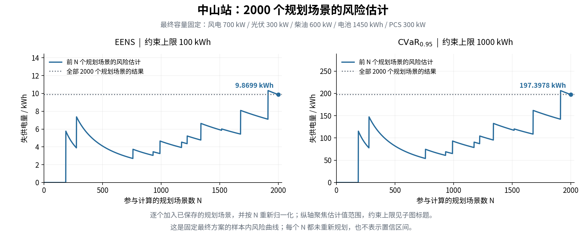
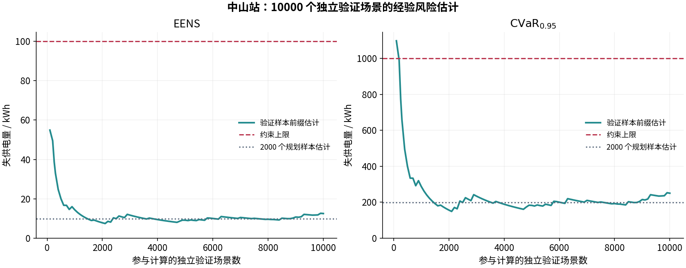

# 中山站：2000 个规划场景、10000 个独立验证场景

全年运行代码为 `38aa201`，状态 `sample_optimal_within_gap`，独立验证 `holdout_passed`。完整流程耗时 783.051 秒，主规划耗时 358.344 秒，独立场景评价耗时 326.495 秒。

## 配置与复现

```bash
cd /home/yzk/reliable_plan
./run.sh plan --config config/zhongshan_2000.toml --solver-config config/solver_3600_1pct.toml
```

使用 cap_plan 虚拟环境和中山站数据、Gurobi 13.0.1。2000 个规划场景（种子 20260906），10000 个独立验证场景（种子 20260907）。每次经济及场景求解时限 3600 秒，经济主问题和成本复算 gap 1%；正失供可靠性子问题保持零 gap。3600 秒不是整个场景实验的总时限。完整实际配置见 [resolved_config.json](../reports/zhongshan_uc_8760_2000_10000/resolved_config.json)。

输入沿用前一中山站算例：原始 2020 闰年 8784 小时，取前 8760 小时（1 月 1 日至 12 月 30 日）；374 个辐照缺失值按 cap_plan 方法补齐，用电量 2,038,009.396834 kWh。启停、最低出力、最小开停机时间、储能互斥及故障假设保持一致，气候开关关闭。

## 容量与成本

| 设备 | 容量 | 模块数 |
|---|---:|---:|
| 风电 | 700 kW | 7 |
| 光伏 | 300 kW | 3 |
| 柴油 | 600 kW | 2 |
| 电池 | 1450 kWh | 29 |
| PCS | 300 kW | 6 |

主规划可行成本 **3,362,791.24 元/年**：年均资本 1,606,666.67 元，标称燃油 1,756,124.57 元，启动 0.00 元。有效全局成本下界 3,329,535.90 元，实际 gap **0.988921%**。固定容量复算成本 3,362,791.24 元。达到 1% gap 的含义是该固定样本和容量网格上的成本界，不等同于证明精确全局最优。

相较前一次 256 个规划场景的运行，风、光、柴油容量相同，电池由 1000 增至 1450 kWh，PCS 由 400 降至 300 kW；本次主规划成本低 14,073.30 元/年，约 0.42%。两次运行的样本数、求解时限及 gap 设置同时变化，这一差值不能单独归因于增加场景数。

## 双风险结果

| 指标 | 上限 | 2000 个规划场景 | 10000 个独立验证场景 |
|---|---:|---:|---:|
| EENS，kWh | 100 | 9.869889 | 12.508809 |
| CVaR₀.₉₅，kWh | 1000 | 197.397773 | 250.176188 |

规划样本中 11 个场景发生正失供，最大损失 6152.600624 kWh；独立验证中 44 个发生正失供，最大损失 10891.303597 kWh。验证 EENS 样本标准误为 2.544734 kWh。全部场景已完成，并由输出 CSV 独立复算风险指标一致；独立验证场景不参与构造 cut。

每个场景都使用同一套中山站 8760 小时风光、负荷基准数据，再叠加独立生成的模块故障与维修轨迹。给定容量后，在机组启停、最小出力、最小开停机时间和储能约束下，计算该年度最小累计失供电量 Q_s。EENS 是所有年度场景损失的等权平均；CVaR₀.₉₅ 是损失最大的 5% 年度场景的平均，规划样本对应最差 100 个场景，独立验证对应最差 500 个场景。

本次两组样本发生失供的比例分别为 0.55% 和 0.44%，均少于 5%，所以最差 5% 中仍含有零失供场景，95% VaR 为零。此时 CVaR₀.₉₅ = EENS / 0.05 = 20 × EENS；因此结果表中这两个指标恰好相差 20 倍。这也意味着在当前稀疏失供区域，CVaR 上限 1000 kWh 相当于要求 EENS 不超过 50 kWh，严于单独的 EENS 上限 100 kWh。最大单场景损失不受 1000 kWh 的单独上界约束。

### 规划场景的风险曲线



上图固定最终容量，依次取保存顺序中的前 N 个规划场景，并以 1/N 重新归一化权重计算 EENS 和 CVaR；每一个 N 的值都已计算并保存，未对曲线做平滑。容量仍由全部 2000 个规划场景确定，各个 N 不重新求解容量规划。灰色虚线是完整规划样本的最终风险。为看清变化，纵轴聚焦实际估计值范围，100 / 1000 kWh 的约束上限标在子图标题中。

前 186 个场景均为零失供，第 187 个场景开始出现正失供；后续计入较大损失会形成明显跳升，计入零失供场景则降低平均值。全部 2000 个规划场景有 11 个发生失供，最终 EENS 为 9.869889 kWh，CVaR 为 197.397773 kWh。样本尾段仍出现明显跳升，因此该图用于观察样本内估计随场景数量与顺序的变化，不能作为统计收敛或总体可靠性的置信证明。

| 前 N 个规划场景 | EENS，kWh | CVaR₀.₉₅，kWh | 正失供场景数 |
|---:|---:|---:|---:|
| 256 | 4.210866 | 84.217318 | 1 |
| 500 | 4.096918 | 81.938356 | 2 |
| 1000 | 4.615209 | 92.304189 | 5 |
| 1500 | 5.924751 | 118.495030 | 8 |
| 2000 | 9.869889 | 197.397773 | 11 |

表中 N=256 仍使用本次最终容量，区别于上一版重新规划得到的 256 场景容量方案。可下载 [全部 2000 个曲线点 CSV](../reports/zhongshan_uc_8760_2000_10000/training_convergence.csv) 和 [规划风险曲线 PDF](../reports/zhongshan_uc_8760_2000_10000/training_convergence.pdf)。

### 独立验证场景的风险曲线



上图使用同一验证样本池的前 N 个场景计算经验风险，展示样本数量的影响；两组曲线均不表示统计置信区间。

## 算法、审计与性能

规划 2 轮、1 条 cut。规划评价中直接构造的零失供证书 1840 个，含储能的固定策略零失供证书 149 个，完整 UC MILP 求解 11 次。独立验证对应为 9346、610、44。所有零失供证书均经过物理与启停审计，非零可行损失不会被当作最优值。

第一轮仅配 1 台柴油机，CVaR 下界已超过 1000 kWh。将其他设备提高到容量上界后，CVaR 下界仍为 1035.730832 kWh；这条强化 cut 证明，在本次固定规划样本及既定容量范围内，至少需要 2 台柴油机。第二轮的 2 台柴油方案随后完成全部 2000 个场景的含启停评价，并同时通过 EENS/CVaR。

逐轮规划的风险变化只有以下两个候选点。第一轮使用 42 个场景的松弛损失和其余场景的非负下界，按完整 2000 场景概率计算失败证据；它与上面的前 N 个场景重新归一化曲线含义不同。

| 规划轮次 | 柴油机台数 | EENS，kWh | CVaR₀.₉₅，kWh | 结论 |
|---:|---:|---:|---:|---|
| 1 | 1 | ≥ 51.965924，下界 | ≥ 1039.318486，下界 | CVaR 已失败；EENS 尚不能判定通过 |
| 2 | 2 | 9.869889，完整评价 | 197.397773，完整评价 | 两项均通过 |

另逐条核对了最终容量的 12000 条场景检查点：场景编号、权重、失供量均与导出 CSV 一致；所有非零损失都有零 gap 的完整 MILP 最优记录，零损失都有已审计的可行调度及目标非负下界作为证据。核对计数保存在结果摘要的 `checkpoint_audit` 中。

44 项测试通过，48 点穷举仍得到相同最优值 12.1 元。对前一版 256 个中山站验证场景逐个回归，故障轨迹指纹相同，失供量最大差约 9e-13 kWh；同一次比较的评价耗时从约 283 秒降至 14 秒，见 [回归记录](../reports/large_sample_regression.json)。

标称调度无失供，功率平衡、储能动态、周期电量及启停审计通过；启动/停机次数 584/584。导出 CSV 功率平衡残差 4.54e-10 kW，储能转移残差 3.96e-10 kWh，成本重算差 9.31e-10 元。

- [摘要及审计](../reports/zhongshan_uc_8760_2000_10000/summary.json)
- [12000 个年度场景损失](../reports/zhongshan_uc_8760_2000_10000/scenario_losses.csv)
- [逐轮历史](../reports/zhongshan_uc_8760_2000_10000/history.json)
- [输入文件指纹](../reports/zhongshan_uc_8760_2000_10000/input_manifest.json)
- [最终完成状态及耗时](../reports/zhongshan_uc_8760_2000_10000/progress.json)

本机完整输出：`outputs/zhongshan_uc_8760_2000_10000/`，包含实际配置、输入指纹、完整 NPZ 场景、逐小时调度、阶段进度及逐场景检查点。模型采用完全预见调度，故障参数仍为研究假设；有限样本通过不等于总体可靠性的统计置信认证。
