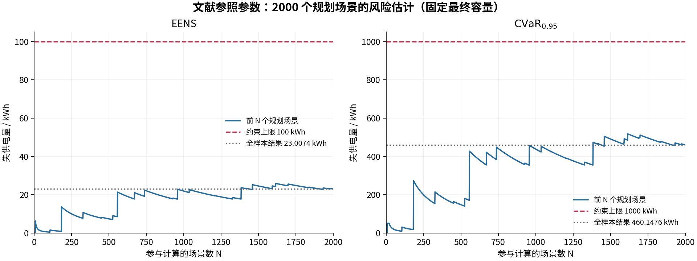
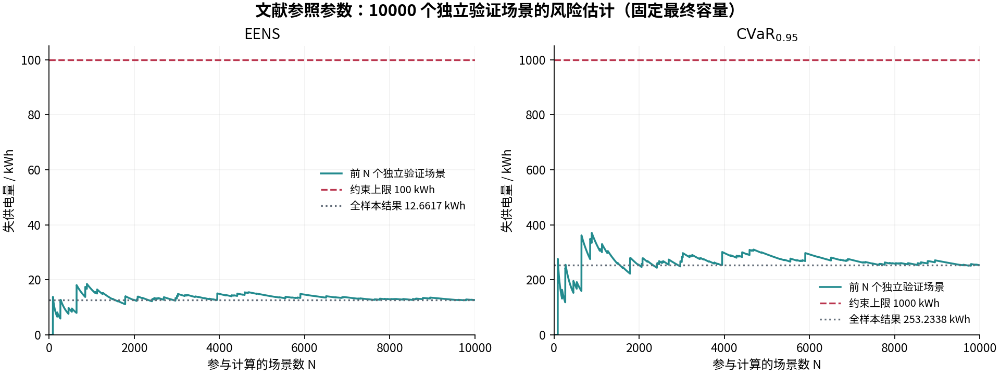

# 中山站：文献参照故障参数下的全年重新规划

使用代码 `3b75bb0`，主规划状态 `sample_optimal_within_gap`，独立验证状态 `holdout_passed`。完整运行耗时 **993.564 秒**，主规划 469.979 秒，独立场景评价 427.111 秒。

## 文献依据与模型核查

完整依据见 [故障模型核查与文献参照参数](failure_parameter_review.md)。任意已安装模块均可能故障，也允许多机同时故障；原风机参数偏乐观，柴油机则需要区分运行小时与日历小时的故障率口径。新配置把柴油机的 MTTF 从 10000 h 改为 1100 h、维修均值从 48 h 改为 37.3 h；风机改为 MTTF 7540 h、维修均值 87 h；光伏采用单逆变通道 MTTF 13500 h、从 98% 可用率推得的等效不可用时间 275.5102 h。PCS 仍为明确的研究假设。

新值是文献参照敏感性参数，缺少中山站实测故障/检修数据。柴油机按日历时间承受连续暴露，未按实际开机小时暂停故障时钟；没有单独的启动失败、共因事故或电芯故障模型。

## 配置与复现

```bash
cd /home/yzk/reliable_plan
./run.sh plan --config config/zhongshan_literature_2000.toml \
  --solver-config config/solver_3600_1pct.toml
```

使用 cap_plan 虚拟环境、Gurobi 13.0.1、中山站原始 CSV 的前 8760 小时。原始 2020 闰年有 8784 小时，本次窗口为 1 月 1 日至 12 月 30 日；补齐 374 个辐照缺失值。2000 个规划场景，种子 20260906；10000 个独立验证场景，种子 20260907。每次 Gurobi 求解上限 3600 秒，经济 gap 1%；正失供可靠性子问题要求零 gap。EENS/CVaR 限值、容量边界、模块大小、气候开关和启停参数沿用原大样本算例。

## 容量与成本

| 设备 | 原研究假设方案 | 文献参照方案 |
|---|---:|---:|
| 风电 | 700 kW | 700 kW |
| 光伏 | 300 kW | 300 kW |
| 柴油 | 600 kW | 900 kW |
| 电池 | 1450 kWh | 1200 kWh |
| PCS | 300 kW | 300 kW |

文献参照方案的年成本 **3,508,931.70 元**，其中年均资本 1,694,166.67 元、标称燃油 1,814,765.03 元、启动 0.00 元。有效全局下界 **3,477,024.05 元**，实际 gap **0.909327%**。与原方案的 3,362,791.24 元相比，成本变化 146,140.46 元，变化率 4.3458%。

## 双风险结果

| 指标 | 上限，kWh | 2000 个规划场景 | 10000 个独立验证场景 |
|---|---:|---:|---:|
| EENS，kWh | 100 | 23.007381 | 12.661689 |
| CVaR₀.₉₅，kWh | 1000 | 460.147629 | 253.233778 |

规划样本正失供 26 个，最大年度失供 8252.575497 kWh；验证正失供 106 个，最大年度失供 9366.329636 kWh。验证 EENS 标准误 2.061436 kWh。

原假设下原方案的验证 EENS/CVaR 为 12.508809 / 250.176188 kWh。两行结果对应不同故障分布与重新优化的容量，不能把风险数值差简单解释为同一条件下的可靠性改善或退化。





两图固定本次最终容量，按前 N 个场景重新归一化计算风险，均展示所有整数 N 的曲线点，没有重新规划或平滑。曲线描述经验估计随样本数量与顺序的变化，不是统计置信区间。

## 规划过程与审计

规划共 2 轮、1 条 cut。带 `>=` 的值为原始固定样本风险下界，仅用于证明候选失败；接受的最终容量经过全部 2000 个场景的完整 UC 评价。

| 轮次 | 柴油机数 | EENS，kWh | CVaR，kWh | 评价性质 |
|---:|---:|---:|---:|---|
| 1 | 1 | >= 56.906387 | >= 1138.127742 | 下界，已判失败 |
| 2 | 3 | 23.007381 | 460.147629 | 完整评价，通过 |

第一轮 cut 强化时，将非柴油设备提高至容量上界，即风电 700 kW、光伏 300 kW、电池 7000 kWh、PCS 1000 kW，2 台柴油机的 CVaR 下界仍为 1000.132419 kWh，超过上限。这证明本次固定规划样本与参照参数下至少需要 3 台柴油机；这一结论限定在模型和参数范围内。

47 项测试通过，包括任意单台、多台柴油机故障进入 UC 的核查。全部 12000 条最终场景检查点与 CSV 逐项一致；非零损失均有严格零 gap 的最优记录，零损失由经审计的合法调度及非负目标下界证明。标称运行无失供，全年启动/停机 959/959 次，功率平衡最大残差 8.74e-11 kW、储能转移残差 2.08e-10 kWh，成本重算差 9.31e-10 元。

- [结果摘要与审计](../reports/zhongshan_literature_8760_2000_10000/summary.json)
- [12000 个年度场景失供量](../reports/zhongshan_literature_8760_2000_10000/scenario_losses.csv)
- [完整实际配置](../reports/zhongshan_literature_8760_2000_10000/resolved_config.json)
- [逐轮规划历史](../reports/zhongshan_literature_8760_2000_10000/history.json)
- [规划曲线数据](../reports/zhongshan_literature_8760_2000_10000/training_convergence.csv)
- [验证曲线数据](../reports/zhongshan_literature_8760_2000_10000/validation_convergence.csv)

本机原始输出位于 `outputs/zhongshan_literature_8760_2000_10000/`，保留输入指纹、完整故障 NPZ、逐小时调度及逐场景检查点。独立验证结果属于文献参照假设下的经验检验，未提供总体风险的置信认证。

## 逐机故障核查

本次 10000 个独立验证场景中，每个场景都有某类已安装设备出现不可用。柴油机逐台统计如下，故障次数是跨 10000 个年度样本的正常转故障总次数。

| 柴油机 | 出现不可用的年度场景数 | 故障次数 | 不可用时间占比 |
|---|---:|---:|---:|
| 第 1 台 | 9996 | 77279 | 3.3017% |
| 第 2 台 | 9998 | 76966 | 3.3009% |
| 第 3 台 | 9998 | 76968 | 3.3291% |

三个模块均出现故障，时间占比约 3.3%，与新配置的离散链稳态不可用率 3.3209% 相符。7461 个年度场景出现过至少两台柴油机同时不可用；其中 246 个出现过三台同时不可用。是否发生失供，还取决于故障时的风光出力、负荷、储能与启停条件。

[逐模块完整故障统计](../reports/zhongshan_literature_8760_2000_10000/fault_audit.json)。
