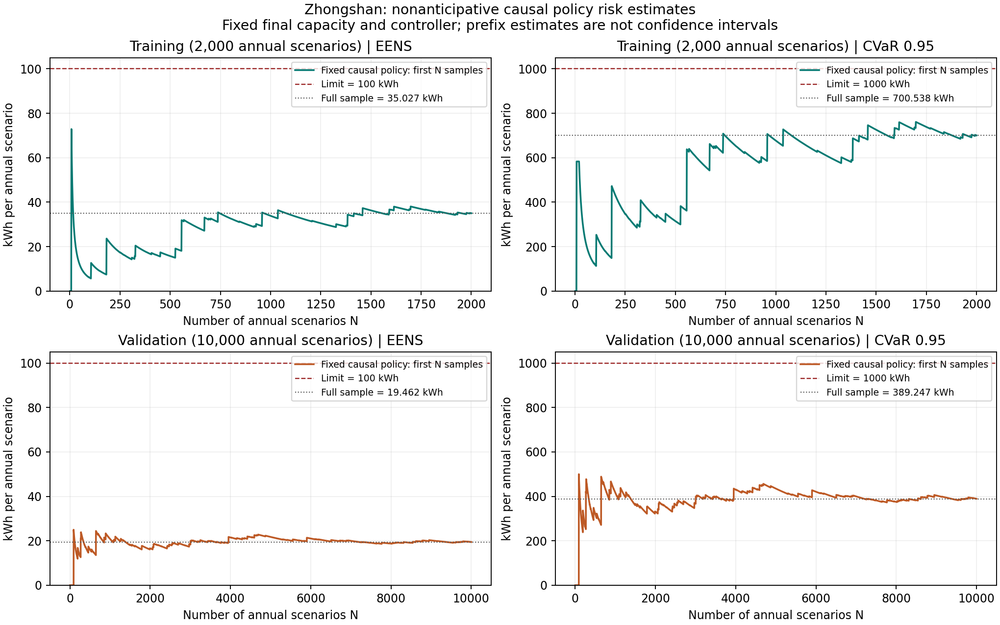

# Zhongshan 全年非预见规划：2000 规划场景与 10000 独立验证场景

运行已完整结束，状态 `sample_optimal_within_gap`，独立验证 `holdout_passed`。使用 Zhongshan 8760 小时数据、文献参照故障参数、风机/光伏各最多 10 个模块、经济 gap 1%、Gurobi 每次求解时限 3600 秒。运行日期为 2026-09-14（America/Los_Angeles）。

本次利用 [因果可行策略证据与松弛风险下界](nonanticipative_certificates.md) 完成非预见容量规划。接受方案有一套对未见历史也能执行的因果控制器；失败 cut 来自完全预见 LP 松弛风险下界，不能由控制器失败单独触发。未建立数亿变量的联合模型，也未用完全预见通过来代替非预见通过。

## 容量与经济结果

| 设备 | 容量 | 模块数 |
|---|---:|---:|
| 风电 | 600 kW | 6 |
| 光伏 | 700 kW | 7 |
| 柴油机 | 900 kW | 3 |
| 电池 | 1050 kWh | 21 |
| PCS | 150 kW | 3 |

| 经济指标 | 结果 |
|---|---:|
| 年规划成本 | **3,285,878.17 元/年** |
| 年均资本 | 1,698,750.00 元/年 |
| 标称燃料成本 | 1,587,128.17 元/年 |
| 启动成本 | 0 元/年，沿用原设置 |
| 有效成本下界 | 3,259,053.47 元/年 |
| 实际 gap | **0.816363%** |
| 固定容量经济复算可行成本 | 3,283,778.89 元/年 |

经济复算比主规划成本低 2099.27 元，是容许非零 gap 时找到更好标称调度的结果。主规划成本与原导出标称调度口径对应；没有把经济复算得到的改善误当成物理审计失败。

主规划采用标称燃料成本。事故因果策略的燃料消耗未进入该目标：验证样本中该策略平均柴油发电约 2,037,939.81 kWh/年，对应约 6,793,132.72 元/年的柴油费用。这个供电优先策略的年度燃料费用不能用表中的标称燃料成本代替。

## 双风险和独立验证

| 指标 | 限值 | 2000 规划场景 | 10000 独立验证场景 |
|---|---:|---:|---:|
| EENS | 100 kWh | **35.026916 kWh** | **19.462343 kWh** |
| CVaR₀.₉₅ | 1000 kWh | **700.538312 kWh** | **389.246855 kWh** |
| 正失供场景数 | — | 85（4.25%） | 396（3.96%） |
| 最大单场景失供量 | — | 7711.391667 kWh | 10025.923334 kWh |
| EENS 标准误 | — | 不用于规划后置信声明 | 2.416613 kWh |

两组样本正失供比例均低于 5%，故此处 95% VaR 为零，CVaR 恰为 EENS 的 20 倍。单场景最大损失不受 1000 kWh 的硬上限限制。所有数值是固定概率模型下的样本指标，未构造总体风险置信区间。

规划和验证冻结同一控制器：保持最多 2 台柴油机在线，按当前可用状态启用冷备用，遵守最小停机时间；已在线机组在故障前不主动停机。事故评价期间电池保持初始 SOC 0.8，充放电均为零，因此每条轨迹首尾库存严格一致。控制器按当前负荷和可用风光补足供给，剩余不足记为失供。

电池仍参与标称经济规划。事故策略不使用它，是本次可行性证据的保守选择；报告的是该控制器的风险表现，不是最佳非预见储能调度的最小失供量。

## 同一容量、同一场景的历史完全预见对照

历史 20000/100000 运行在中断前已保存本容量的完整 20000 条规划损失和前 18472 条验证检查点。本次仅取其中前 2000/10000 条作为对照，不将中断实验描述为完成 100000 场景。

已逐字节比较风、光、柴油、PCS 的可用轨迹和天气/出力因子的对应样本前缀，且五个源 CSV 的 SHA-256 一致，容量亦完全相同。

| 指标 | 历史完全预见调度 | 本次因果策略 | 变化 |
|---|---:|---:|---:|
| 同 2000 场景 EENS | 22.474901 kWh | 35.026916 kWh | +55.85% |
| 同 2000 场景 CVaR₀.₉₅ | 449.498029 kWh | 700.538312 kWh | +55.85% |
| 同 10000 场景 EENS | 11.447607 kWh | 19.462343 kWh | +70.01% |
| 同 10000 场景 CVaR₀.₉₅ | 228.952137 kWh | 389.246855 kWh | +70.01% |

这说明原容量存在可执行、达标的因果策略，但实际策略风险高于理想完全预见基准。差异同时包含备用规则、事故储能未使用以及初始 SOC 从场景可优化改为固定值等效应，不能单独解释为非预见性的纯粹代价。

## 规划过程与审计

共 2 轮规划、1 条强化 cut。即使配置风电 1000 kW、光伏 1000 kW、电池 7000 kWh、PCS 1000 kW，2 台柴油机方案在 1213 个已计算场景与其余场景非负下界构成的固定 2000 样本风险下界中，仍有

$$EENS\ge 50.595992\ \mathrm{kWh},\qquad CVaR_{0.95}\ge1011.919841\ \mathrm{kWh}.$$

CVaR 下界已超限，所以本次容量范围和固定规划样本下至少需要 3 台柴油机。最终 3 台方案的因果策略通过双约束，经济上、下界之差达到 1% 内。这个经济证书对应固定样本和标称成本定义，不是对总体风险或因果策略燃料最优性的认证。

60 项测试通过。全部 12000 条最终容量检查点逐一核对了场景编号、损失、控制器指纹、物理/UC 审计和初末库存；训练与验证控制器指纹一致。事故调度审计最大误差为 $2.84\times10^{-14}$。标称调度也无失供，功率平衡、储能动态及启停审计通过。

| 计算阶段 | 耗时/计数 |
|---|---:|
| 场景预生成 | 91.88 秒 |
| 读取已有样本后的规划及验证全流程 | **594.45 秒，约 9.91 分钟** |
| 其中规划循环 | 516.68 秒 |
| 最终 2000 场景因果评价 | 3.57 秒 |
| 10000 场景独立评价 | 17.38 秒 |
| 松弛场景求解/证书计数 | 14700 |
| 巨型联合模型求解次数 | 0 |

松弛只用于下界，因果策略只用于可行上界；本例两类证据足以完成规划。若它们不能决定某个有竞争力的容量，程序会返回未决，而非保证所有大样本问题都能以这个速度解出。

## 风险曲线及复现



图中固定最终容量和控制器，对前 N 个场景重新归一化计算风险；未为不同 N 重新规划。曲线是描述性估计变化，不是统计置信带。

```bash
OPENBLAS_NUM_THREADS=1 OMP_NUM_THREADS=1 ./run.sh plan \
  --config config/zhongshan_nonanticipative_2000.toml \
  --solver-config config/solver_3600_1pct.toml
```

本次实际复用了预先生成的场景，命令另带 `--scenarios outputs/nonanticipative_2000_10000_preparation_20260914/training_scenarios.npz` 和对应 `--validation-scenarios` 参数。全时域为中山 2020 年 CSV 前 8760 小时（闰年最后 24 小时不在窗口内），补值及其余数据读取口径沿用历史版本。

- [结果摘要](../reports/zhongshan_nonanticipative_8760_2000_10000/summary.json)
- [检查点复核](../reports/zhongshan_nonanticipative_8760_2000_10000/postprocess_audit.json)
- [控制器定义](../reports/zhongshan_nonanticipative_8760_2000_10000/accident_controller.json)
- [同容量历史对照与限定](../reports/zhongshan_nonanticipative_8760_2000_10000/same_capacity_comparison.json)
- [轨迹前缀逐项核查](../reports/zhongshan_nonanticipative_8760_2000_10000/matched_historical_paths.json)
- [规划场景损失](../reports/zhongshan_nonanticipative_8760_2000_10000/scenario_losses.csv)
- [独立验证损失](../reports/zhongshan_nonanticipative_8760_2000_10000/validation_losses.csv)
- [风险曲线 PDF](../reports/zhongshan_nonanticipative_8760_2000_10000/risk_curves.pdf)

完整本机输出：`outputs/zhongshan_nonanticipative_8760_2000_10000_20260914/`，包含原始样本、标称小时调度和所有逐场景检查点。
