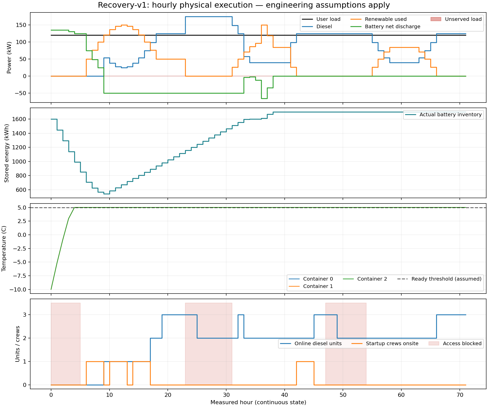
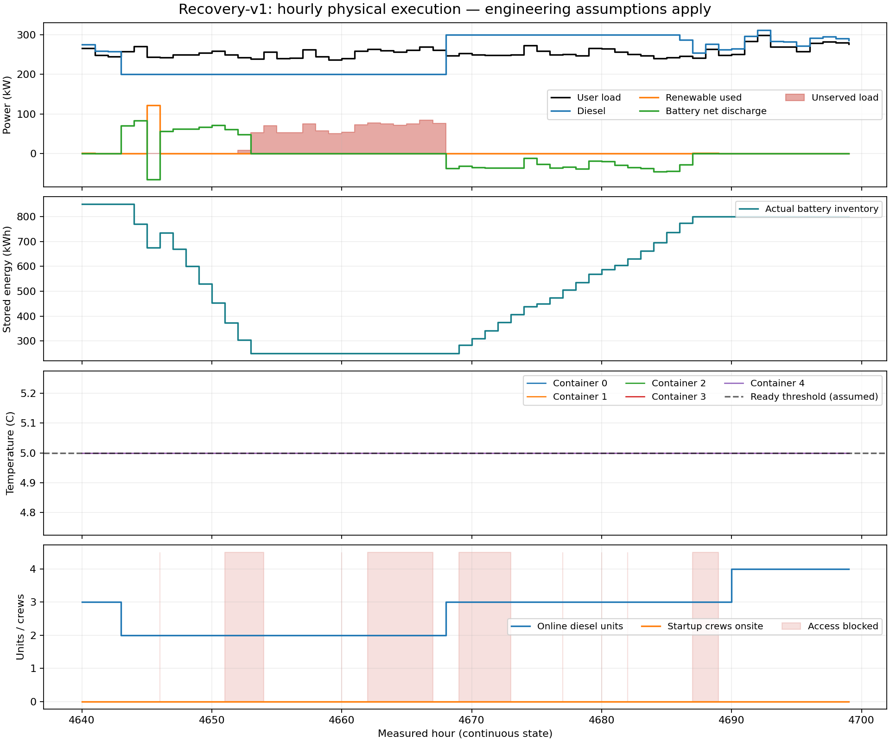

# 中山 Recovery-v1 实现与测试报告

本轮已经实现并实际运行人员可达性、集装箱热状态、风机覆冰和柴油在线暴露相互关联的小时级规划程序。最终完成 **8760 小时、128 个训练场景、256 个新独立验证场景**，验证通过。结论严格限定于预声明的 **48 个容量点、2 套因果策略、固定天气记录与工程假设**。

**本结果是中山原始曲线驱动的工程压力测试，`synthetic=true`，不是现场标定后的正式建设建议。** 原始曲线包含原始输入气温，但缺少经过确认的集装箱热参数、现场覆冰/可达性标签及聚合负荷的辅助用电计量口径。程序在正式模式下拒绝缺少来源与关键参数的输入。

## 最终可复核结果

| 量 | 结果 |
|---|---:|
| 风电 | 500 kW |
| 光伏 | 300 kW |
| 柴油 | 500 kW，5 × 100 kW 研究模块 |
| 电池 | 1000 kWh |
| PCS | 200 kW |
| 冻结策略 | `heat_first_four_online`：在线目标至少 4 台、加热优先、SOC 补能目标 0.8 |
| 年化投资 | 1,210,000.00 元 |
| 同一策略的样本平均实际运行费用 | 4,309,867.49 元 |
| 训练目标总费用 | **5,519,867.49 元 / 8760 h** |
| 固定网格、固定样本、固定策略库内 gap | 0% |
| 总工作流墙钟时间 | 628.24 s，含 4 个容量分区、完整网格复核及独立验证 |
| 实际存档的训练年度路径 | 8750 条；包含多个容量/策略，提前失败筛选保留原权重 |

| 风险指标 | 128 个训练场景 | 256 个独立验证场景 | 约束上限 |
|---|---:|---:|---:|
| EENS | 0.608099 kWh | **5.537067 kWh** | 100 kWh |
| CVaR₀.₉₅ | 12.161979 kWh | **110.741337 kWh** | 1000 kWh |
| VaR₀.₉₅ | 0.000000 kWh | 0.000000 kWh | — |
| 非零失供比例 | 0.781250%，1/128 | 1.562500%，4/256 | — |
| 尾部有效场景数 | 6.4 | 12.8 | — |

两组 VaR 为零，因此此次 CVaR 恰为 EENS 的 20 倍；不能把这两项描述成完全独立的信息。样本内状态为 `sample_optimal_within_policy_library_gap`，独立验证状态为 `holdout_passed_empirically`，`population_certified=false`。单场景最大失供 1002.886751 kWh 不是 CVaR；二者不应混淆。

容量网格采用模块数：风 `[5,7]`、光 `[2,3]`、柴油 `[4,5,6]`、电池 `[20,40]`、PCS `[4,6]`。风/光/柴油模块 100 kW，电池 50 kWh，PCS 50 kW。若增加容量候选、允许新的策略或调整假设，最优点可能改变。尤其本次电池候选从 1000 kWh 起，不能把“选择 1000 kWh”解释成已经证明了所有容量范围中的最低需要量。

## 保留小样本验证失败，没有用验证集再选策略

| 试验 | 训练/验证数 | 容量：风/光/柴油/电池/PCS | 训练 EENS / CVaR | 独立验证 EENS / CVaR | 验证状态 |
|---|---|---|---|---|---|
| 保护停机，小样本 | 16 / 128 | 500 / 300 / 400 / 2000 / 200 | 13.342 / 213.468 | 136.552 / 2409.503 | 失败 |
| 允许范围内运行、极端危险率乘 2，小样本 | 16 / 128 | 500 / 300 / 400 / 1000 / 200 | 92.331 / 898.542 | 108.328 / 2070.244 | 失败 |
| 保护停机，扩大训练 | 128 / 256 | 500 / 300 / 500 / 1000 / 200 | 0.608 / 12.162 | 5.537 / 110.741 | 通过 |

表中电池单位为 kWh，其余容量为 kW。两套小样本风机规则的失败证据保留，不能从“继续运行成本低”推断其可靠性已经满足。扩大实验保持原容量网格、策略库、风险阈值与训练种子 `2026091701`，采用新验证种子 `2026091703`；小样本验证种子为 `2026091702`。最终方案在新验证集产生之前冻结，没有逐场景或利用验证集重新选策略。

较大训练样本选中了更多在线柴油容量及更高备用水平；实际燃油同时进入经济目标，所以不是只在可靠性验证里免费维持备用。这也解释了为什么电池从小样本候选的 2000 kWh 变成 1000 kWh：控制策略与柴油运行方式一同改变，不能归因于单个物理参数。

## 物理机制是否真实起作用

72 小时手工事件测试包含到场受阻、准备、升温、1 次启动失败、2 次柴油运行故障、1 次风机机械故障、残冰保护和连续 SOC；储能实际放电 931.94 kWh，用户失供为零。

在 12 点合成小网格中，即时备用 R0 和固定 3 小时延迟 R1 都选择 600 kWh 电池，但把这些方案放入同一个完整 R3 评价器后，EENS 均为 583.718 kWh，超过该实验 100 kWh 的上限。R2（天气＋人员）与 R3（天气＋人员＋热状态）选择 2000 kWh，完整评价为零失供。这证明简化模型可以选错容量；本合成例中 R2 与 R3 容量相同，并不宣称温度在所有设置下都会改变容量。



中山固定容量敏感性实验使用小样本训练方案及相同 16 个训练基本随机数，不重新选型：

| 变化 | EENS / CVaR，kWh | 说明 |
|---|---:|---|
| 基准加热器 12 kW | 13.342 / 213.468 | 温度阻塞均值 0.25 机组小时 |
| 加热器 6 kW | 29.870 / 477.924 | 热状态影响风险 |
| 加热器 3 kW | 3435.172 / 14656.519 | 温度阻塞增至 155.25 机组小时 |
| 运行 MTTF 1180 h | 92.287 / 1263.121 | CVaR 超过 1000 kWh |
| 运行 MTTF 2410 h | 0 / 0 | 仅此有限样本内为零，不等于零故障风险 |
| 即时、固定延迟、天气＋准备但忽略热状态 | 各为 0 / 0 | 同一容量下会低估完整模型风险 |

另外已计算热身 0/168/336/672 h、启动失败率 0.0010/0.0013/0.0017、固定 37 h 与几何修复、人员模式、两组人员、残冰时长等。此次几种热身设置的失供指标一致，但运行成本/库存与电池吞吐不同，不能据此证明 336 h 总能达到平稳。

最终 256 个验证场景的平均实物量为：加热 88,585.68 kWh、柴油 287,240.29 kg、储能实际放电 11.848 kWh、柴油运行故障 21.188 次。最终策略依靠较多柴油在线，储能平均使用较少，但绝非“永不充放电”的旧策略。

阻塞统计按互斥原因计数；最终平均到场受阻 4.930、准备 1.113、等待班组 0.004、温度阻塞 0.000 机组小时。对于这组默认热参数和温控策略，温度在最终验证中没有单独阻塞启动；不能据此否定热模型的重要性。每个请求的准备完成、温度首次达标与启动时间另存，窗口接续电量和失供电量见 `recovery_comparison_v1/expanded_recovery_windows.csv`，重叠窗口不得累加成年度总量。



## 验证、范围与复现

- 39 项新增验收/并行工作流测试通过；原规划器 60 项测试通过。
- 72 h 物理闭环通过；12 点完整穷举、风险筛选和缓存续算得到相同的库内最优结果。
- 容量分区并行与串行完整搜索的小算例最优结果完全一致；并行合并严格检查原始数据、源码、噪声机制、库内策略及物理参数。
- 完整 CLI 断点续算在副本目录复核，容量、策略和验证风险逐项相同。
- 最坏验证场景为 `seed=2026091703, scenario=176`，独立审计包含热身在内的 9096 小时；功率残差 3.91e-14 kW，SOC 残差 0 kWh，热更新残差 9.77e-15 ℃，无审计违规。每条模拟路径另检查功率与储能可行性。
- 另有既有 certified 测试 70/76 通过、6 项失败，原因是旧 SHA256 清单已与当前 HEAD 的 7 个文件不符。7 个工作区文件均与本轮开始时 HEAD 字节一致，本轮没有修改旧文件，也没有重写旧清单掩盖问题。证据见 `reports/recovery_legacy_isolation_audit.json`。

8760 小时来自中山 2020 闰年 CSV 的前 8760 小时，结束于 12 月 30 日 23:00；原始完整 CSV 是 8784 小时。原负荷/风速/气温未被改写，374 个太阳辐射缺值沿用旧加载器补值。时间戳时区明确标记为假设 UTC+08。此次联合压力标签有 370 小时禁止新派遣、1073 小时覆冰保护；标签由同一气象序列构建，并非实测暴风雪/覆冰判定。

热参数 UA=0.15 kW/K、C=1.5 kWh/K、加热器 12 kW、阈值 5℃、一机一箱、一组启动人员等仍是研究输入；额外加热电耗与历史负荷是否重叠有待核实。100 kW 是研究额定值；最低出力 20%、线性燃油转换 4.5 kWh/kg 沿用研究口径，不是该 100 kW 南极 CAT 的已确认厂家油耗曲线。固定箱体/加热器购置与保温价格未独立校准，当前费用不是采购预算。

经济目标为同一因果策略的真实运行费用加年化投资，不能直接与旧版“无故障标称经济调度费用”的数字做收益比较。样本内经济下界只用非负投资费用；第一版没有高级 LP 恢复耦合割，不声称所有控制策略上的全局最优，也不声称罕见尾部已充分收敛或总体可靠性认证。

运行入口与参数说明见 [README_RECOVERY.md](../README_RECOVERY.md)，迁移核查见 [recovery_migration_audit.md](recovery_migration_audit.md)。

```bash
# 与最终实验相同的 128/256 配置，串行完整网格入口
./run_recovery.sh plan --config config/zhongshan_recovery_128_256.toml \
  --output outputs/zhongshan_recovery_128_256

# 相同物理模型和网格的四分区并行工作流
/home/yzk/cap_plan/venv/bin/python -m scripts.recovery_parallel_grid \
  --config config/zhongshan_recovery_128_256.toml \
  --samples 128 --validation-samples 256 --validation-seed 2026091703 \
  --workers 4 --output outputs/zhongshan_recovery_parallel
```

原始输出路径：

- 最终完整网格、风险、策略与轨迹：`reports/zhongshan_recovery_8760_protective_128_256_v1/full_grid/`。
- 并行总耗时、分区与合并证据：`reports/zhongshan_recovery_8760_protective_128_256_v1/workflow_summary.json`。
- 两套 16/128 失败试验：`reports/zhongshan_recovery_8760_protective_16_128_v1/` 与 `reports/zhongshan_recovery_8760_operating_16_128_v1/`。
- 合成物理/穷举对照：`reports/recovery_synthetic_72h_v3/`。
- 固定容量敏感性：`reports/recovery_fixed_design_sensitivity_v1/`。
- 图、年度场景前缀诊断和恢复窗口：`reports/recovery_comparison_v1/`。

输出为 CSV/JSON（嵌套逐机状态为 JSON 单元格），没有把内核测试替代全年规划验证，也没有覆盖旧数据或旧实验。
