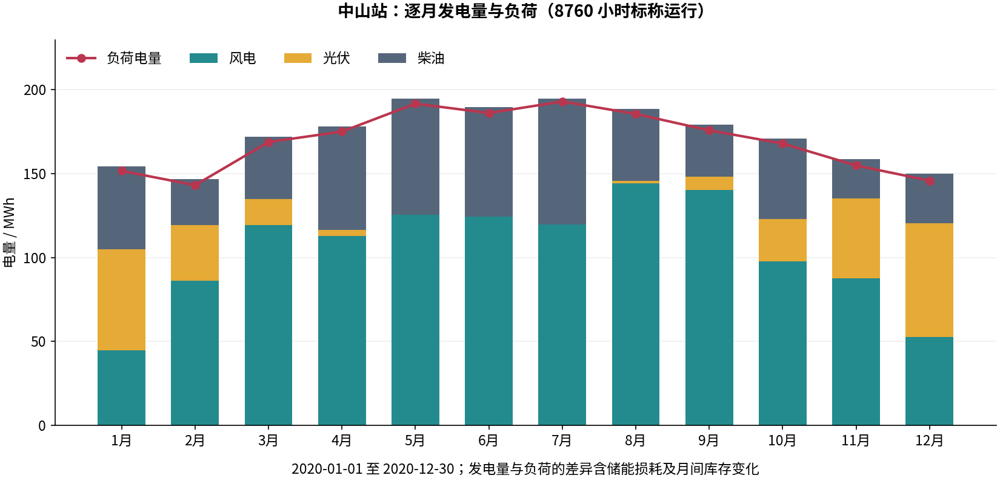

# 中山站 8760 小时、256 个规划场景运行结果

本次运行使用代码 `3eb166f`，启用机组启停、EENS/CVaR 双约束和坐标提升 cut。规划样本 256 个，另用 256 个独立样本验证；训练种子 20260906，验证种子 20260907。状态为 `sample_feasible`，独立验证状态为 `holdout_passed`。

## 输入与复现

```bash
cd /home/yzk/reliable_plan
./run.sh plan --case zhongshan --hours 8760 --samples 256 --validation-samples 256 --output outputs/zhongshan_uc_8760_256
```

复现时换用新的输出目录。使用 `/home/yzk/cap_plan/venv/bin/python`、Gurobi 13.0.1 和 `/home/yzk/cap_plan/data/zhongshan/input/`。原始数据是 2020 闰年的 8784 小时，本次按现有读取逻辑取前 8760 小时，即 1 月 1 日 00:00 至 12 月 30 日 23:00。374 个辐照缺失值按 cap_plan 方法补齐。用电量 2,038,009.396834 kWh，最小/最大负荷 178.445/323.710 kW。

每台柴油机 300 kW、最低出力 60 kW、最小开停机时间各 3 小时；启动单价为零。气候开关关闭，故障率和维修时间使用原有研究假设。EENS 上限 100 kWh，CVaR₀.₉₅ 上限 1000 kWh，均针对本次 8760 小时总损失。主问题每轮 120 秒、2 线程；场景子问题 60 秒、1 线程。

## 容量与成本

| 设备 | 容量 | 模块数 |
|---|---:|---:|
| 风电 | 700 kW | 7 |
| 光伏 | 300 kW | 3 |
| 柴油 | 600 kW | 2 |
| 电池 | 1000 kWh | 20 |
| PCS | 400 kW | 8 |

主规划可行成本 **3,376,864.54 元/年**，其中年均资本 1,515,000.00 元、标称燃油 1,861,864.54 元、启动 0.00 元。有效全局下界 3,329,282.82 元，gap **1.409050%**，Gurobi 状态 9。固定容量经济复算另得可行成本 3,371,979.44 元；其最优标志为 `false`。成本目标采用标称运行费用。

## 可靠性结果

| 指标 | 限值 | 256 个规划场景 | 256 个独立验证场景 |
|---|---:|---:|---:|
| EENS，kWh | 100 | 5.138991 | 43.161469 |
| CVaR₀.₉₅，kWh | 1000 | 102.779818 | 863.229374 |

规划样本中 1 个场景发生正失供，最大年度损失 1315.581667 kWh；独立样本中 3 个发生正失供，最大损失 6166.860925 kWh。以上指标均已完整评价，并从导出的场景 CSV 独立复算一致。验证样本不参与构造 cut。

规划共 2 轮、1 条 cut，主规划耗时 632.581 秒（不含随后审计和独立验证）。第一轮 CVaR 下界为 1073.797627 kWh，已超过限值。其强化后的 cut 顶点为风电 700 kW、光伏 300 kW、柴油 300 kW、电池 7000 kWh、PCS 1000 kW，CVaR 下界 1212.389169 kWh。其他设备均达到设计上界，因此该 cut 证明当前固定样本下柴油至少需要 2 台；相应的 EENS 下界未超限本身不能证明 EENS 通过。

## 运行审计与数据文件

最终标称调度功率平衡、储能动态、周期电量及 UC 审计通过。导出 CSV 的最大功率平衡残差 2.43e-10 kW、最大储能转移残差 4.12e-10 kWh，充放电互斥、无失供和成本重算通过；启停次数为 609 / 609。

- [结果摘要及审计](../reports/zhongshan_uc_8760_256/summary.json)
- [512 个年度场景的失供量](../reports/zhongshan_uc_8760_256/scenario_losses.csv)
- [逐轮规划历史](../reports/zhongshan_uc_8760_256/history.json)
- [标称月度发电量](../reports/zhongshan_uc_8760_256/monthly_energy.csv)



原始输出保存在本机 `outputs/zhongshan_uc_8760_256/`，含逐小时调度、输入指纹、实际配置和完整 NPZ 故障场景。场景运行仍采用完全预见调度，可靠性属于当前假设分布下的有限样本结果；`sample_feasible` 不代表已证明成本最优，`holdout_passed` 不代表总体风险的统计置信认证。完整模型见 [模型说明](model.md)。
