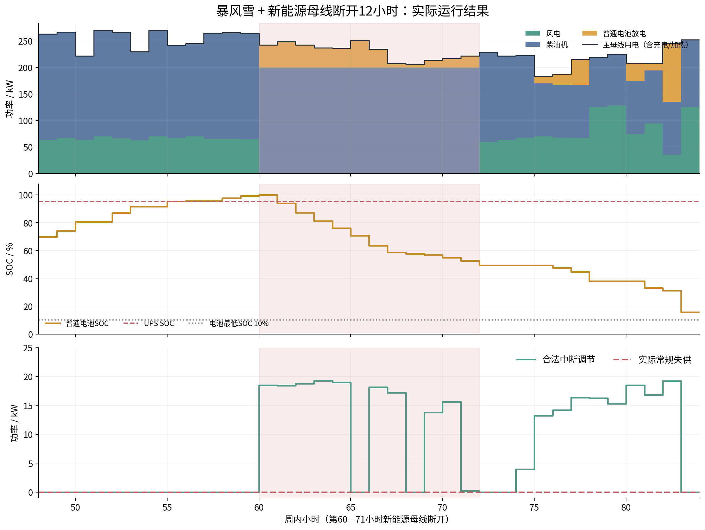
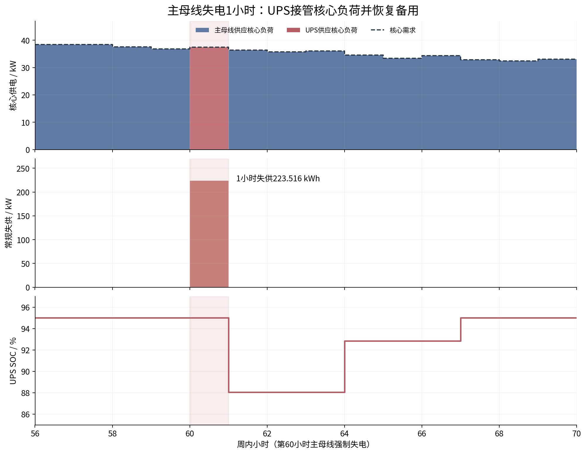

# 168小时规划与12小时设备恢复：结果检查报告

本次计算已完成，并达到设定的最优性精度。最终配置为风电200 kW、柴发2台共200 kW、普通电池750 kWh、储能PCS 150 kW、UPS 550 kWh／100 kW，光伏为0。总目标费用为1,486,418.11元，含导出的全流程耗时约31分53.4秒，相对最优性差距为0.0134813%。

保存的逐时调度、整数模块、费用和韧性指标经独立复核一致。所有建模分支的核心负荷失供为0；暴风雪叠加新能源母线断开12小时的分支中，常规负荷实际失供也为0，但使用了合法负荷调节。只有主母线强制失电1小时的两个天气分支发生常规负荷失供。

## 1. 本次结果对应什么问题

| 项目 | 本次设置 |
|---|---|
| 数据 | 冻结合成年度数据的第792—959小时，2026年2月3日至9日，UTC+08:00 |
| 主规划时域 | 168小时，步长1小时 |
| 韧性子窗口 | 周内第24—95小时，共72小时，16个条件分支 |
| 极端天气 | 周内第48—77小时暴风雪；第24小时发布日前天气信号 |
| 设备故障恢复 | 新能源母线、PCS、UPS、柴发运行故障和启动失败维修均为12小时 |
| 主母线失电 | 按已确认设置，保持1小时 |
| UPS桥接要求 | 按核心峰值负荷连续供电12小时确定最低容量 |
| 容量决策 | 七类容量均为优化变量，直接采用整数模块，无求解后取整 |
| 外部电网 | 不启用，系统独立供电 |
| 时间预算 | 15000秒；本次提前满足最优性精度，未触及上限 |
| 财务口径 | 一次性投资 + 168小时期望运行及失供费用，未年化、未放大到全年 |
| 风险口径 | 本次168小时场景树上的EENS与95% CVaR；限额分别为100和1000 kWh |

下文小时编号从0开始，第60小时表示区间$[60,61)$；连续12小时故障为$[60,72)$。柴发故障仅在实际运行或实际启动尝试时暴露，因此其实际故障起点不一定为第60小时。

## 2. 求解完成情况与耗时

| 指标 | 数值 |
|---|---:|
| 完成状态 | 达到设定的最优性精度，已有完整可行解 |
| 建模时间 | 10.6824秒 |
| 求解器运行时间 | 1899.0824秒，约31分39.1秒 |
| 建模、计算与审计 | 1910.6619秒 |
| 含结果导出的全流程时间 | 1913.4231秒，约31分53.4秒 |
| 首个整数可行解出现时间 | 求解开始后957.5808秒，约15分57.6秒 |
| 可行解目标值 | 1,486,418.1085元 |
| 已证明目标下界 | 1,486,217.7205元 |
| 上下界差额 | 200.3880元 |
| 最终相对最优性差距 | 0.0134813% |
| 设定允许差距 | 0.1% |

这意味着，在当前模型和场景树内，尚未排除的进一步改进空间最多约200.39元。结果已经满足设定精度，但不称为零差距的精确最优解。

模型含317,387个变量，其中205,552个为二进制变量，另有7个容量整数变量；线性约束1,072,727条，指示约束90,660条。运行于2026年9月24日07:28:56 UTC开始，08:00:50 UTC结束。

## 3. 全部设备配置与投资

| 设备 | 单模块规格 | 整数模块数 | 最终容量 | 投资/元 |
|---|---:|---:|---:|---:|
| 风电 | 100 kW | 2 | 200 kW | 300,000 |
| 光伏 | 100 kW | 0 | 0 kW | 0 |
| 柴油机 | 100 kW/台 | 2 | 200 kW | 360,000 |
| 普通储能电池 | 50 kWh | 15 | 750 kWh | 187,500 |
| 储能PCS | 50 kW | 3 | 150 kW | 60,000 |
| UPS电量 | 50 kWh | 11 | 550 kWh | 412,500 |
| UPS功率 | 50 kW | 2 | 100 kW | 120,000 |
| **合计** | — | — | — | **1,440,000** |

容量均由整数变量直接确定。普通电池与储能PCS配套，额定时长为$750/150=5$小时，超过模型1小时的最低配套要求。没有出现只有PCS而没有电池的配置。

### 3.1 为什么UPS仍有550 kWh

本周核心负荷峰值为39.315922 kW。UPS待机SOC为95%、最低SOC为5%、放电效率为98%，12小时桥接约束为：

$$
E_U\ge\frac{39.315922\times12}{(0.95-0.05)\times0.98}
=534.910499\ \mathrm{kWh}.
$$

UPS功率要求采用核心峰值的1.5倍：

$$
P_U\ge1.5\times39.315922=58.973882\ \mathrm{kW}.
$$

在50 kWh和50 kW的模块规格下，最小可行配置就是550 kWh／100 kW。最终解恰好取到这两个整数下限。这里的整数下限直接进入规划变量及约束，以上计算用于解释配置结果。

因此，这次UPS规模主要由预设的12小时桥接要求决定。实际16个分支中，UPS仅在主母线失电的1小时供电，其他14个分支没有放电。应区分“容量设计要求支持12小时”和“本次调度实际使用1小时”。若认为UPS仍偏大，应首先讨论桥接时长及峰值负荷口径是否符合工程需求。

普通电池与PCS合计投资247,500元，UPS两部分合计532,500元。UPS电量单价750元/kWh、功率单价1200元/kW，分别是普通电池250元/kWh和PCS 400元/kW的3倍。本次较大的UPS配置可以由硬性容量下限解释，不能据此认定模型在经济性上更偏好UPS。

## 4. 费用核对

| 费用项 | 结果/元 | 解释 |
|---|---:|---|
| 设备投资 | 1,440,000.0000 | 上表各设备投资之和 |
| 柴发运行 | 23,811.3831 | 电输出及在线空载等效消耗 |
| 常规负荷失供损失 | 22,351.5699 | 期望失供电量乘1000元/kWh |
| 合法负荷调节 | 232.8586 | 合法中断及延期执行的平移任务，0.12元/kWh |
| 普通电池吞吐 | 22.2969 | 充放电量之和，0.01元/kWh |
| 外部购电 | 0 | 外部电网未启用 |
| **期望运行及失供费用** | **46,418.1085** | 除投资之外各项之和 |
| **总目标费用** | **1,486,418.1085** | 投资 + 168小时期望费用 |

窗口外的正常轨迹按实际小时计费；窗口内以16个条件分支的加权费用替代对应正常轨迹，未将同一时段重复计费。独立复算得到期望柴油机发电23,799.1238 kWh、在线机组小时253.098，故：

$$
C_D=0.95\times(23799.123772+5\times253.098)
=23811.383084\ \text{元}.
$$

合法中断调节为1109.916619 kWh，延期执行的平移服务为830.571464 kWh，均为本次168小时口径的加权值。因此：

$$
C_{flex}=0.12\times(1109.916619+830.571464)
=232.858570\ \text{元}.
$$

本次检查同时更正了旧组会模型文档的一处费用说明：平移任务在到达小时完成的部分不收取平移调节费用，只有延期执行部分收费。实际程序一直采用这一口径；本次没有更改规划模型、保存的目标值或求解结果。

## 5. 韧性指标与全部分支

| 指标 | 本次结果 | 限额/要求 | 判断 |
|---|---:|---:|---|
| 核心负荷实际失供 | 每个分支均为0 kWh | 每小时零失供 | 满足 |
| 窗口外常规负荷实际失供 | 0 kWh | 纳入风险及费用 | 无损失 |
| 168小时EENS | 22.351570 kWh | 不超过100 kWh | 满足 |
| 95% CVaR上界 | 223.515699 kWh | 不超过1000 kWh | 满足 |
| 单分支最大常规失供 | 223.515699 kWh | 通过风险指标约束 | 出现在主母线失电分支 |

EENS表示按场景权重平均的实际失供电量。CVaR表示损失最严重的尾部场景的平均损失；本例最严重的10%权重均有同样的223.515699 kWh损失，所以最差5%的平均损失也为该值。

下表每行包含正常天气和暴风雪两个分支，共16个。所有分支核心失供均为0；表中失供仅指常规负荷的实际损失，合法调节不计入。

| 设备条件 | 正常天气权重 | 暴风雪权重 | 正常常规失供/kWh | 风雪常规失供/kWh | 实际运行说明 |
|---|---:|---:|---:|---:|---|
| 无设备故障 | 0.480 | 0.120 | 0 | 0 | 风雪仅影响天气和可用资源 |
| 新能源母线断开 | 0.080 | 0.020 | 0 | 0 | 均断开12小时 |
| 主母线失电 | 0.080 | 0.020 | 223.515699 | 223.515699 | 失电1小时，UPS分别供核心37.418626 kWh |
| compound母线故障标签 | 0.064 | 0.016 | 0 | 0 | 风雪分支为暴风雪叠加新能源母线断开12小时 |
| PCS故障 | 0.024 | 0.006 | 0 | 0 | 故障12小时，普通电池充放电均为0 |
| UPS故障 | 0.024 | 0.006 | 0 | 0 | 故障12小时，主系统维持核心供电 |
| 柴发运行故障 | 0.032 | 0.008 | 0 | 0 | 两个分支均在第60小时实际发生运行故障 |
| 柴发启动失败 | 0.016 | 0.004 | 0 | 0 | 正常分支第64小时实际失败；风雪分支未触发启动失败 |

权重来自本次合成场景设置，总和为1；它们不是实测年故障率。恢复时长统一后，`renewable_bus`和`compound`标签在同一天气下具有相同的母线断开条件，不能将16个标签解释成16种完全不同的物理扰动。其权重仍按本次冻结输入保留。

只有两个主母线失电分支产生损失，其合计权重为$0.08+0.02=0.10$：

$$
\mathrm{EENS}=0.10\times223.515699
=22.351570\ \mathrm{kWh}.
$$

这恰好达到当前“主母线失电时常规负荷必须切除”规则造成的损失下限。增加发电或储能容量也不能绕过该失电规则。其目标函数罚损为22,351.57元，已完整计入，UPS接管并没有把常规损失隐藏掉。

## 6. 暴风雪叠加新能源母线断开12小时：如何撑过去

重点检查分支为`w0_storm_compound`。周内第60—71小时新能源母线断开，风光实际输出均为0。

| 第60—71小时的指标 | 结果 |
|---|---:|
| 柴发出力 | 2台各100 kW，连续12小时共2400 kWh |
| 普通电池放电 | 360.381256 kWh |
| 普通电池充电 | 0 kWh |
| 合法可中断负荷调节 | 158.882464 kWh |
| 核心负荷实际失供 | 0 kWh |
| 常规负荷实际失供 | 0 kWh |
| UPS放电 | 0 kWh |
| 故障开始电池电量 | 750 kWh，SOC 100% |
| 故障结束电池电量 | 370.651309 kWh，SOC 49.4202% |

电池交流侧放电量与库存下降考虑了95%的放电效率：

$$
750-\frac{360.381256}{0.95}=370.651309\ \mathrm{kWh}.
$$

日前天气信号发布时，即第24小时，电池SOC为32.1326%；暴风雪开始的第48小时升至69.8739%，第60小时达到100%。模型利用天气预警调整储能与机组状态；在设备故障被观察到之前，同一信息历史下的分支决策仍须一致。原运行的非预见性审计残差约为$3.74\times10^{-13}$。



图中浅红色区间为12小时母线故障。上图的蓝色柴油机连续维持200 kW，黄色电池补足剩余用电，绿色风电在故障区间为0。中图显示电池逐步放电，而UPS保持95%待机SOC。下图绿色线为合同允许的中断调节，红色虚线为实际常规失供，始终为0。因此，“无实际失供”并不等于原负荷曲线完全不变。

窗口结束时电池回到与正常主轨迹一致的118.037246 kWh，而不是强制充满。整个168小时末电池为450 kWh、UPS为522.5 kWh，分别与周初的60%和95% SOC相同，未靠耗尽期末库存获得虚假经济性。

## 7. 主母线失电：UPS的实际作用

在第60小时，主母线强制失电1小时。该小时核心负荷为37.418626 kW，由UPS全部承担；常规负荷223.515699 kWh被切除，并纳入韧性指标和失供罚损。



图中上栏表示核心负荷供电由主母线切换到UPS，核心需求始终满足；中栏表示这1小时的常规损失；下栏表示UPS SOC由95%下降到88.0578%，随后补电。风雪分支在第67小时恢复95%备用SOC，正常天气分支在第65小时恢复，均满足24小时内补足备用的要求。UPS补电不代表UPS参与日常新能源消纳。

## 8. 两个需要准确解读的结果

**柴发启动失败的标签不等于一定发生启动失败。** 正常天气分支中，第64小时确实出现一次启动失败，故障机组第64—75小时维修，期间无失供。风雪启动失败分支中，相关机组在潜在失败时段已经在线，没有发生启动尝试失败。因此，本次证明的是调度可通过提前在线规避这次启动风险，不能据此声称已经检验“暴风雪中实际冷启动失败12小时仍然安全”。

**风雪加柴发运行故障的储能余量较小。** 该分支第60小时实际发生单机运行故障，随后12小时由剩余机组供电1200 kWh、普通电池放电469.793235 kWh，未发生实际失供。整个分支的最低电池电量为76.052632 kWh，SOC为10.1404%，仅比10%的下限高约1.052632 kWh。该时段以外的故障持续、额外负荷或多设备同时故障并未在本次结果中获得保证。

## 9. 检查范围和结论边界

原求解程序已通过物理和信息约束审计，最大残差为$2.66\times10^{-9}$。本次另从保存的解文件、逐时CSV、NPZ数组和源代码快照独立复算，结果通过，检查项中最大数值差异为$1.08\times10^{-9}$，来自柴发费用复算。

| 检查内容 | 结果 |
|---|---|
| 源码快照与运行记录哈希一致 | 通过 |
| 七类整数模块、容量及投资复算 | 通过，无事后取整 |
| 主母线与核心负荷功率平衡 | 通过 |
| 普通电池、UPS能量递推及SOC范围 | 通过 |
| PCS、UPS、新能源母线故障期间禁用 | 通过 |
| 构网支撑具有实际非零有功 | 通过；当前最小有效功率阈值为1 kW |
| 柴发启动温度、单支准备队伍约束 | 通过 |
| 主轨迹与子窗口电量状态连接、期末库存 | 通过 |
| 分支失供、EENS、CVaR和费用复算 | 通过 |
| 原运行的热状态、任务电量和非预见性审计 | 通过 |

这些结论适用于所建168小时、1小时步长和有限场景树。核心零失供及构网约束是小时级调度条件，不能替代毫秒级UPS切换、电压频率或暂态稳定仿真。各类设备故障按分支分别发生，不表示所有设备同时故障仍然安全。

本次光伏为0，是一次性投资加这一周运行费用口径下的结果；不能直接推广为8760小时或全寿命期规划不需要光伏。同样，当前EENS及CVaR均为这一周指标，不能直接称为年度风险。

## 10. 记录与复现

本次仅检查已有结果、补充图表和纠正文档，未重新启动优化。

- [原始汇总与原运行审计](summary.json)
- [逐时数据独立复核记录](checked_result.json)
- [逐分支复核指标表](checked_scenario_metrics.csv)
- [运行定义、参数及源码哈希](run_definition.json)
- [逐时运行CSV](hourly_dispatch.csv)
- [求解日志](gurobi.log)
- [复核与绘图脚本](../../scripts/check_resilience_week_result.py)

可在项目根目录运行：

```bash
OPENBLAS_NUM_THREADS=1 OMP_NUM_THREADS=1 /home/yzk/cap_plan/venv/bin/python \
  scripts/check_resilience_week_result.py \
  reports/resilience_week_168h_repair12_20260924T072856Z
```

报告内图片使用相对路径，可直接在VS Code的Markdown预览中阅读。若移动文档，请同时保留同目录下的`figures`文件夹。
